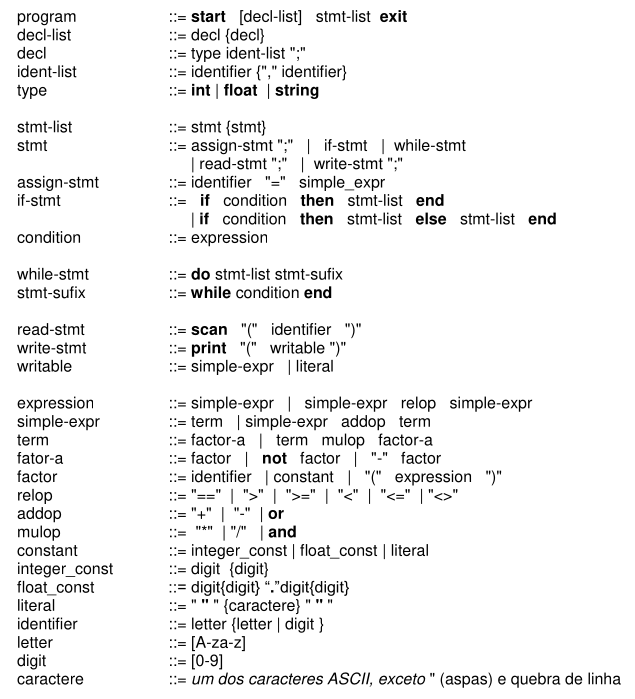

# Compiler-CP

## Language 

### Grammar

## First and Follow Table

* Groups: *mulop*, *relop*, *type*

| Token | First  | Follow |
| :--- | :---: | :---: |
| identifier | **[ identifier ]** | **[ ) ]** **[ , ]** **[ = ]** **[ ; ]** **[ == ]** **[ > ]** **[ >= ]** **[ < ]** **[ <= ]** **[ <> ]** **[ + ]** **[ - ]** **[ or ]** **[ end ]** **[ then ]** **[ * ]** **[ / ]** **[ and ]** |
| literal | **[ literal ]** | **[ == ]** **[ > ]** **[ >= ]** **[ < ]** **[ <= ]** **[ <> ]** **[ + ]** **[ - ]** **[ or ]** **[ end ]** **[ then ]** **[ ) ]** **[ ; ]** **[ * ]** **[ / ]** **[ and ]** |
| float_const | **[ float_const ]** | **[ == ]** **[ > ]** **[ >= ]** **[ < ]** **[ <= ]** **[ <> ]** **[ + ]** **[ - ]** **[ or ]** **[ end ]** **[ then ]** **[ ) ]** **[ ; ]** **[ * ]** **[ / ]** **[ and ]** |
| integer_const | **[ integer_const ]** | **[ == ]** **[ > ]** **[ >= ]** **[ < ]** **[ <= ]** **[ <> ]** **[ + ]** **[ - ]** **[ or ]** **[ end ]** **[ then ]** **[ ) ]** **[ ; ]** **[ * ]** **[ / ]** **[ and ]** |
| mulop | **[ * ]** **[ / ]** **[ and ]** | **[ identifier ]** **[ float_const ]** **[ integer_const ]** **[ literal ]** **[ ( ]** **[ not ]** **[ - ]** |
| relop | **[ == ]** **[ > ]** **[ >= ]** **[ < ]** **[ <= ]** **[ <> ]** | **[ identifier ]** **[ float_const ]** **[ integer_const ]** **[ literal ]** **[ ( ]** **[ not ]** **[ - ]** |
| factor | **[ identifier ]** **[ float_const ]** **[ integer_const ]** **[ literal ]** **[ ( ]** | **[ == ]** **[ > ]** **[ >= ]** **[ < ]** **[ <= ]** **[ <> ]** **[ + ]** **[ - ]** **[ or ]** **[ end ]** **[ then ]** **[ ) ]** **[ ; ]** **[ * ]** **[ / ]** **[ and ]** |
| factor-a | **[ identifier ]** **[ float_const ]** **[ integer_const ]** **[ literal ]** **[ ( ]** **[ not ]** **[ - ]** | **[ == ]** **[ > ]** **[ >= ]** **[ < ]** **[ <= ]** **[ <> ]** **[ + ]** **[ - ]** **[ or ]** **[ end ]** **[ then ]** **[  )]** **[ ; ]** **[ * ]** **[ / ]** **[ and ]** |
| term | **[ identifier ]** **[ float_const ]** **[ integer_const ]** **[ literal ]** **[ ( ]** **[ not ]** **[ - ]** | **[ == ]** **[ > ]** **[ >= ]** **[ < ]** **[ <= ]** **[ <> ]** **[ + ]** **[ - ]** **[ or ]** **[ end ]** **[ then ]** **[ ) ]** **[ ; ]** **[ * ]** **[ / ]** **[ and ]** |
| simple-expr | **[ identifier ]** **[ float_const ]** **[ integer_const ]** **[ literal ]** **[ ( ]** **[ not ]** **[ - ]** | **[ == ]** **[ > ]** **[ >= ]** **[ < ]** **[ <= ]** **[ <> ]** **[ + ]** **[ - ]** **[ or ]** **[ end ]** **[ then ]** **[ ) ]** **[ ; ]** |
| expression | **[ identifier ]** **[ float_const ]** **[ integer_const ]** **[ literal ]** **[ ( ]** **[ not ]** **[ - ]** | **[ end ]** **[ then ]** **[ ) ]** |
| writable | **[ identifier ]** **[ float_const ]** **[ integer_const ]** **[ literal ]** **[ ( ]** **[ not ]** **[ - ]** | **[ ) ]** |
| stmt | **[ print ]** **[ scan ]** **[ while ]** **[ do ]** **[ if ]** **[ identifier ]** | **[ print ]** **[ scan ]** **[ while ]** **[ do ]** **[ if ]** **[ identifier ]** **[ exit ]** **[ while ]** **[ end ]** **[ else ]** |
| stmt-list | **[ print ]** **[ scan ]** **[ while ]** **[ do ]** **[ if ]** **[ identifier ]** | **[ exit ]** **[ while ]** **[ end ]** **[ else ]** |
| write-stmt | **[ print ]** | **[ ; ]** |
| read-stmt | **[ scan ]** | **[ ; ]** |
| stmt-sufix | **[ while ]** | **[ print ]** **[ scan ]** **[ while ]** **[ do ]** **[ if ]** **[ identifier ]** **[ exit ]** **[ while ]** **[ end ]** **[ else ]** |
| while-stmt | **[ do ]** | **[ print ]** **[ scan ]** **[ while ]** **[ do ]** **[ if ]** **[ identifier ]** **[ exit ]** **[ while ]** **[ end ]** **[ else ]** |
| if-stmt | **[ if ]** | **[ print ]** **[ scan ]** **[ while ]** **[ do ]** **[ if ]** **[ identifier ]** **[ exit ]** **[ while ]** **[ end ]** **[ else ]** |
| condition | **[ identifier ]** **[ float_const ]** **[ integer_const ]** **[ literal ]** **[ ( ]** **[ not ]** **[ - ]** | **[ end ]** **[ then ]** |
| assign-stmt | **[ identifier ]** | **[ ; ]** |
| type | **[ int ]** **[ float ]** **[ string ]** | **[ identifier ]** |
| ident-list | **[ identifier ]** | **[ ; ]** |
| decl | **[ int ]** **[ float ]** **[ string ]** | **[ int ]** **[ float ]** **[ string ]** **[ print ]** **[ scan ]** **[ while ]** **[ do ]** **[ if ]** **[ identifier ]** |
| decl-list | **[ int ]** **[ float ]** **[ string ]** | **[ print ]** **[ scan ]** **[ while ]** **[ do ]** **[ if ]** **[ identifier ]** |
| start | **[ start ]** | **[ int ]** **[ float ]** **[ string ]** **[ print ]** **[ scan ]** **[ while ]** **[ do ]** **[ if ]** **[ identifier ]** |
| exit | **[ exit ]** | **[ EOF ]** |
| if | **[ if ]** | **[ identifier ]** **[ float_const ]** **[ integer_const ]** **[ literal ]** **[ ( ]** **[ not ]** **[ - ]** |
| then | **[ then ]** | **[ print ]** **[ scan ]** **[ while ]** **[ do ]** **[ if ]** **[ identifier ]** |
| else | **[ else ]** | **[ print ]** **[ scan ]** **[ while ]** **[ do ]** **[ if ]** **[ identifier ]** |
| end | **[ end ]** | **[ print ]** **[ scan ]** **[ while ]** **[ do ]** **[ if ]** **[ identifier ]** **[ exit ]** **[ while ]** **[ end ]** **[ else ]** |
| do | **[ do ]** | **[ print ]** **[ scan ]** **[ while ]** **[ do ]** **[ if ]** **[ identifier ]** |
| while | **[ while ]** | **[ identifier ]** **[ float_const ]** **[ integer_const ]** **[ literal ]** **[ ( ]** **[ not ]** **[ - ]** |
| scan | **[ scan ]** | **[ ( ]** |
| print | **[ print ]** | **[ ( ]** |
| not | **[ not ]** | **[ identifier ]** **[ float_const ]** **[ integer_const ]** **[ literal ]** **[ ( ]** |
| minus | **[ - ]** | **[ identifier ]** **[ float_const ]** **[ integer_const ]** **[ literal ]** **[ ( ]** **[ not ]** **[ - ]** |
| plus | **[ + ]** | **[ identifier ]** **[ float_const ]** **[ integer_const ]** **[ literal ]** **[ ( ]** **[ not ]** **[ - ]** |
| or | **[ or ]** | **[ identifier ]** **[ float_const ]** **[ integer_const ]** **[ literal ]** **[ ( ]** **[ not ]** **[ - ]** |
| semicolon | **[ ; ]** | **[ int ]** **[ float ]** **[ string ]** **[ print ]** **[ scan ]** **[ while ]** **[ do ]** **[ if ]** **[ identifier ]** **[ exit ]** **[ while ]** **[ end ]** **[ else ]** |
| coma | **[ , ]** | **[ identifier ]** |
| open-parenthesis | **[ ( ]** | **[ identifier ]** **[ float_const ]** **[ integer_const ]** **[ literal ]** **[ ( ]** **[ not ]** **[ - ]** |
| close-parenthesis | **[ ) ]** | **[ == ]** **[ > ]** **[ >= ]** **[ < ]** **[ <= ]** **[ <> ]** **[ + ]** **[ - ]** **[ or ]** **[ end ]** **[ then ]** **[ ) ]** **[ ; ]** **[ * ]** **[ / ]** **[ and ]** |
| assign | **[ = ]** | **[ identifier ]** **[ float_const ]** **[ integer_const ]** **[ literal ]** **[ ( ]** **[ not ]** **[ - ]** |

## Linux

To build or run is necessary be inside the folder of the project (Compiler-CP)

### Build

    ./cp build

### Execute
    
    ./cp run [ files ]

## Windows

To build or run is necessary be inside the folder of the project (Compiler-CP)

### Build

    cd compiler
    mvn clean package assembly:single

#### Execute
    
    java -cp compiler/target/compiler-1.0-jar-with-dependencies.jar compiler.App [ files ]

### Fazer

1. Checar funcionamento
2. Implementar panic mode
3. Implementar Syntax Analyser
4. Implementar Semantic Analyser
5. Implementar Code Generator