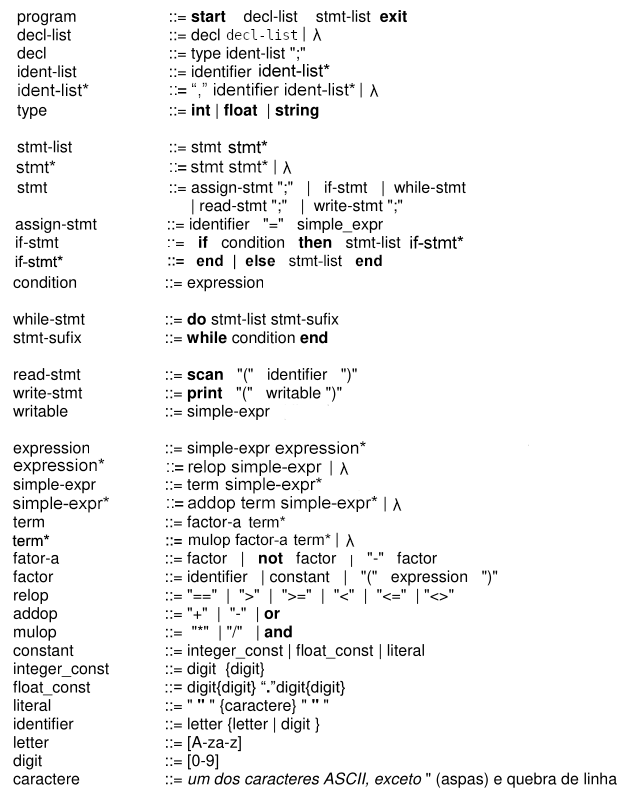

# Compiler-CP

## Language 

### Grammar

### Improved Grammar

## First and Follow Table

* Groups: *mulop*, *relop*, *type*

| **Nonterminal Symbols** |||
| :--- | :---: | :---: |
| Symbol | First  | Follow |
| program | *[ start ]* | *[ $ ]* |
| decl-list | *[ int ]* *[ float ]* *[ string ]* | **stmt-list:**  *[ print ]* *[ scan ]* *[ do ]* *[ if ]* *[ identifier ]* *[ / ]* |

| decl | *[ int ]* *[ float ]* *[ string ]* | *[ int ]* *[ float ]* *[ string ]* *[ print ]* *[ scan ]* *[ do ]* *[ if ]* *[ identifier ]* |
| ident-list | *[ identifier ]* | *[ ; ]* |
| assign-stmt | *[ identifier ]* | *[ ; ]* |
| condition | *[ identifier ]* *[ float_const ]* *[ integer_const ]* *[ literal ]* *[ ( ]* *[ not ]* *[ - ]* | *[ end ]* *[ then ]* |
| if-stmt | *[ if ]* | *[ print ]* *[ scan ]* *[ do ]* *[ if ]* *[ identifier ]* *[ exit ]* *[ while ]* *[ end ]* *[ else ]* |
| if-stmt* |*[ end ]* *[ else ]* | *[ print ]* *[ scan ]* *[ do ]* *[ if ]* *[ identifier ]* *[ exit ]* *[ while ]* *[ end ]* *[ else ]* |
| while-stmt | *[ do ]* | *[ print ]* *[ scan ]* *[ do ]* *[ if ]* *[ identifier ]* *[ exit ]* *[ while ]* *[ end ]* *[ else ]* |
| stmt-sufix | *[ while ]* | *[ print ]* *[ scan ]* *[ do ]* *[ if ]* *[ identifier ]* *[ exit ]* *[ while ]* *[ end ]* *[ else ]* |
| read-stmt | *[ scan ]* | *[ ; ]* |
| write-stmt | *[ print ]* | *[ ; ]* |
| stmt-list | *[ print ]* *[ scan ]* *[ do ]* *[ if ]* *[ identifier ]* | *[ exit ]* *[ while ]* *[ end ]* *[ else ]* |
| stmt | *[ print ]* *[ scan ]* *[ do ]* *[ if ]* *[ identifier ]* | *[ print ]* *[ scan ]* *[ do ]* *[ if ]* *[ identifier ]* *[ exit ]* *[ while ]* *[ end ]* *[ else ]* |
| writable | *[ identifier ]* *[ float_const ]* *[ integer_const ]* *[ literal ]* *[ ( ]* *[ not ]* *[ - ]* | *[ ) ]* |
| expression | *[ identifier ]* *[ float_const ]* *[ integer_const ]* *[ literal ]* *[ ( ]* *[ not ]* *[ - ]* | *[ end ]* *[ then ]* *[ ) ]* |
| simple-expr | *[ identifier ]* *[ float_const ]* *[ integer_const ]* *[ literal ]* *[ ( ]* *[ not ]* *[ - ]* | *[ == ]* *[ > ]* *[ >= ]* *[ < ]* *[ <= ]* *[ <> ]* *[ + ]* *[ - ]* *[ or ]* *[ end ]* *[ then ]* *[ ) ]* *[ ; ]* |
| term | *[ identifier ]* *[ float_const ]* *[ integer_const ]* *[ literal ]* *[ ( ]* *[ not ]* *[ - ]* | *[ == ]* *[ > ]* *[ >= ]* *[ < ]* *[ <= ]* *[ <> ]* *[ + ]* *[ - ]* *[ or ]* *[ end ]* *[ then ]* *[ ) ]* *[ ; ]* *[ * ]* *[ / ]* *[ and ]* |
| term* | *[ * ]* *[ / ]* *[ and ]* *[ identifier ]* *[ float_const ]* *[ integer_const ]* *[ literal ]* *[ ( ]* *[ not ]* *[ - ]* | *[ == ]* *[ > ]* *[ >= ]* *[ < ]* *[ <= ]* *[ <> ]* *[ + ]* *[ - ]* *[ or ]* *[ end ]* *[ then ]* *[ ) ]* *[ ; ]* *[ * ]* *[ / ]* *[ and ]* |
| factor-a | *[ identifier ]* *[ float_const ]* *[ integer_const ]* *[ literal ]* *[ ( ]* *[ not ]* *[ - ]* | *[ == ]* *[ > ]* *[ >= ]* *[ < ]* *[ <= ]* *[ <> ]* *[ + ]* *[ - ]* *[ or ]* *[ end ]* *[ then ]* *[  )]* *[ ; ]* *[ * ]* *[ / ]* *[ and ]* |
| factor | *[ identifier ]* *[ float_const ]* *[ integer_const ]* *[ literal ]* *[ ( ]* | *[ == ]* *[ > ]* *[ >= ]* *[ < ]* *[ <= ]* *[ <> ]* *[ + ]* *[ - ]* *[ or ]* *[ end ]* *[ then ]* *[ ) ]* *[ ; ]* *[ * ]* *[ / ]* *[ and ]* |

| **Terminal Symbols** |||
| :--- | :---: | :---: |
| Symbol | First  | Follow |
| start | *[ start ]* | *[ int ]* *[ float ]* *[ string ]* *[ print ]* *[ scan ]* *[ do ]* *[ if ]* *[ identifier ]* |
| exit | *[ exit ]* | *[ EOF ]* |
| type | *[ int ]* *[ float ]* *[ string ]* | *[ identifier ]* |
| if | *[ if ]* | *[ identifier ]* *[ float_const ]* *[ integer_const ]* *[ literal ]* *[ ( ]* *[ not ]* *[ - ]* |
| then | *[ then ]* | *[ print ]* *[ scan ]* *[ do ]* *[ if ]* *[ identifier ]* |
| else | *[ else ]* | *[ print ]* *[ scan ]* *[ do ]* *[ if ]* *[ identifier ]* |
| end | *[ end ]* | *[ print ]* *[ scan ]* *[ do ]* *[ if ]* *[ identifier ]* *[ exit ]* *[ while ]* *[ end ]* *[ else ]* |
| do | *[ do ]* | *[ print ]* *[ scan ]* *[ do ]* *[ if ]* *[ identifier ]* |
| while | *[ while ]* | *[ identifier ]* *[ float_const ]* *[ integer_const ]* *[ literal ]* *[ ( ]* *[ not ]* *[ - ]* |
| scan | *[ scan ]* | *[ ( ]* |
| print | *[ print ]* | *[ ( ]* |
| not | *[ not ]* | *[ identifier ]* *[ float_const ]* *[ integer_const ]* *[ literal ]* *[ ( ]* |
| mulop | *[ * ]* *[ / ]* *[ and ]* | *[ identifier ]* *[ float_const ]* *[ integer_const ]* *[ literal ]* *[ ( ]* *[ not ]* *[ - ]* |
| relop | *[ == ]* *[ > ]* *[ >= ]* *[ < ]* *[ <= ]* *[ <> ]* | *[ identifier ]* *[ float_const ]* *[ integer_const ]* *[ literal ]* *[ ( ]* *[ not ]* *[ - ]* |
| minus | *[ - ]* | *[ identifier ]* *[ float_const ]* *[ integer_const ]* *[ literal ]* *[ ( ]* *[ not ]* *[ - ]* |
| plus | *[ + ]* | *[ identifier ]* *[ float_const ]* *[ integer_const ]* *[ literal ]* *[ ( ]* *[ not ]* *[ - ]* |
| or | *[ or ]* | *[ identifier ]* *[ float_const ]* *[ integer_const ]* *[ literal ]* *[ ( ]* *[ not ]* *[ - ]* |
| semicolon | *[ ; ]* | *[ int ]* *[ float ]* *[ string ]* *[ print ]* *[ scan ]* *[ do ]* *[ if ]* *[ identifier ]* *[ exit ]* *[ while ]* *[ end ]* *[ else ]* |
| coma | *[ , ]* | *[ identifier ]* |
| open-parenthesis | *[ ( ]* | *[ identifier ]* *[ float_const ]* *[ integer_const ]* *[ literal ]* *[ ( ]* *[ not ]* *[ - ]* |
| close-parenthesis | *[ ) ]* | *[ == ]* *[ > ]* *[ >= ]* *[ < ]* *[ <= ]* *[ <> ]* *[ + ]* *[ - ]* *[ or ]* *[ end ]* *[ then ]* *[ ) ]* *[ ; ]* *[ * ]* *[ / ]* *[ and ]* |
| assign | *[ = ]* | *[ identifier ]* *[ float_const ]* *[ integer_const ]* *[ literal ]* *[ ( ]* *[ not ]* *[ - ]* |
| identifier | *[ identifier ]* | *[ ) ]* *[ , ]* *[ = ]* *[ ; ]* *[ == ]* *[ > ]* *[ >= ]* *[ < ]* *[ <= ]* *[ <> ]* *[ + ]* *[ - ]* *[ or ]* *[ end ]* *[ then ]* *[ * ]* *[ / ]* *[ and ]* |
| literal | *[ literal ]* | *[ == ]* *[ > ]* *[ >= ]* *[ < ]* *[ <= ]* *[ <> ]* *[ + ]* *[ - ]* *[ or ]* *[ end ]* *[ then ]* *[ ) ]* *[ ; ]* *[ * ]* *[ / ]* *[ and ]* |
| float_const | *[ float_const ]* | *[ == ]* *[ > ]* *[ >= ]* *[ < ]* *[ <= ]* *[ <> ]* *[ + ]* *[ - ]* *[ or ]* *[ end ]* *[ then ]* *[ ) ]* *[ ; ]* *[ * ]* *[ / ]* *[ and ]* |
| integer_const | *[ integer_const ]* | *[ == ]* *[ > ]* *[ >= ]* *[ < ]* *[ <= ]* *[ <> ]* *[ + ]* *[ - ]* *[ or ]* *[ end ]* *[ then ]* *[ ) ]* *[ ; ]* *[ * ]* *[ / ]* *[ and ]* |

## Reports

1. [Lexical](doc/Report_1.md)

## Linux

To build or run is necessary be inside the folder of the project (Compiler-CP)

### Build

    ./cp build

### Execute
    
    ./cp run [ files ]

### Testar
    
    ./cp test

## Windows

To build or run is necessary be inside the folder of the project (Compiler-CP)

### Build

    cd compiler
    mvn clean package assembly:single

#### Execute
    
    java -cp compiler/target/compiler-1.0-jar-with-dependencies.jar compiler.App [ files ]

## Java

If you want run from the .jar just go to the releases folder

### Fazer

1. Implementar panic mode
2. Implementar Syntax Analyser
3. Implementar Semantic Analyser
4. Implementar Code Generator