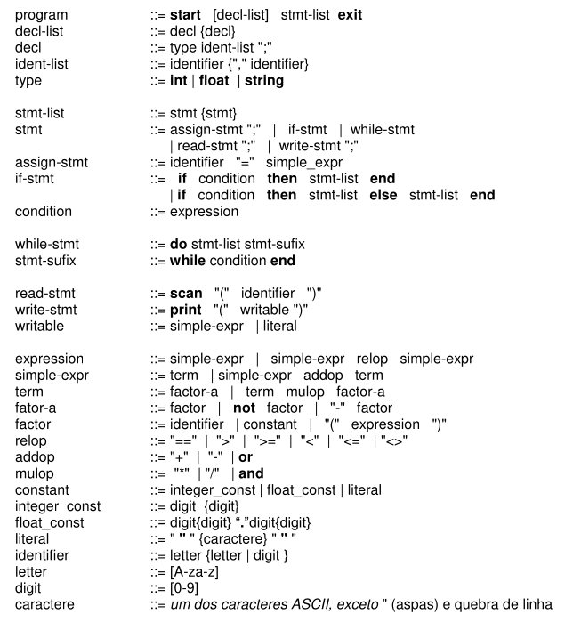

# Relatório Analisador Sintático
**Nome:** *Emanoel*, *Miguel*

## Introdução
Essa etapa trata de dar continuidade à etapa 1 (Implementação do analisador Léxico), ao implementar o analisador Sintático do compilador.

## Gramática
A gramática foi modificada para possibilitar o uso do parser LL(1) especificado no enunciado do trabalho. Abaixo estão as imagens da gramática antes e depois.

### Antes


### Depois


### Modificações
* **Recurção a esquerda removida**
  * term
  * simple-expr
* **Prefixo comum removido**
  * term
  * if-stmt
  * expression
* **Ambiguidade removida**
  * program
  * writable
* **Loop removido**  
  * decl-list
  * ident-list
  * stmt-list

## Comentários
Os comentários são tratados no analisador léxico para evitar tornar o código do sintático mais complexo. Quando o léxico encontra um comentário ele ignora os próximos caracteres até encontrar o fim do comentário seja ele de uma linha ou múltiplas.

## Panic Mode
Para implementar o panic mode foi criada uma classe chamada "Panic Mode" que é chamada toda vez que ocorre algum erro sintático. A implementação exigiu o calculo da tabela de first e follow que esta logo abaixo.

### First e Follow
* Grupos: *mulop*, *relop*, *type*


| **Símbolos_não_terminais** |||
| :--- | :---: | :---: |
| Symbol | First  | Follow |
| program | *[ start ]* | *[ $ ]* |
| decl-list | *[ int ]* *[ float ]* *[ string ]* | **stmt-list:**   *[ print ]* *[ scan ]* *[ do ]* *[ if ]* *[ identifier ]* |
| decl | *[ int ]* *[ float ]* *[ string ]*  | **decl-list:**    *[ int ]* *[ float ]* *[ string ]* **stmt-list:**   *[ print ]* *[ scan ]* *[ do ]* *[ if ]* *[ identifier ]* |
| ident-list | *[ identifier ]* | **decl:**:    *[ ; ]* |
| ident-list-asterisk |*[ , ]* | **ident-list:**    *[ ; ]* |
| stmt-list | *[ print ]* *[ scan ]* *[ do ]* *[ if ]* *[ identifier ]* | **program:**  *[ exit ]*  **if-stmt-asterisk:**    *[ end ]* *[ else ]*    **stmt-sufix:**  *[ while ]*|
| stmt | *[ print ]* *[ scan ]* *[ do ]* *[ if ]* *[ identifier ]* | **stmt-asterisk:** *[ print ]* *[ scan ]* *[ do ]* *[ if ]* *[ identifier ]* **program:**  *[ exit ]*  **if-stmt-asterisk:**    *[ end ]* *[ else ]*    **stmt-sufix:**  *[ while ]* |
| stmt-asterisk | *[ print ]* *[ scan ]* *[ do ]* *[ if ]* *[ identifier ]* | **program:**  *[ exit ]*  **if-stmt-asterisk:**    *[ end ]* *[ else ]*    **stmt-sufix:**  *[ while ]* |
| assign-stmt | *[ identifier ]* | **stmt:** *[ ; ]* |
| if-stmt | *[ if ]* | **stmt-asterisk:** *[ print ]* *[ scan ]* *[ do ]* *[ if ]* *[ identifier ]* **program:**  *[ exit ]*  **if-stmt-asterisk:**    *[ end ]* *[ else ]*    **stmt-sufix:**  *[ while ]* |
| while-stmt | *[ do ]* | **stmt-asterisk:** *[ print ]* *[ scan ]* *[ do ]* *[ if ]* *[ identifier ]* **program:**  *[ exit ]*  **if-stmt-asterisk:**    *[ end ]* *[ else ]*    **stmt-sufix:**  *[ while ]* |
| read-stmt | *[ scan ]* |  **stmt:** *[ ; ]* |
| write-stmt | *[ print ]* | **stmt:** *[ ; ]* |
| if-stmt* |*[ end ]* *[ else ]* | **stmt-asterisk:** *[ print ]* *[ scan ]* *[ do ]* *[ if ]* *[ identifier ]* **program:**  *[ exit ]*  **if-stmt-asterisk:**    *[ end ]* *[ else ]*    **stmt-sufix:**  *[ while ]* |
| condition | *[ identifier ]* *[ float_const ]* *[ integer_const ]* *[ literal ]* *[ ( ]* *[ not ]* *[ - ]* | **stmt-sufix:** *[ end ]* **if-stmt:** *[ then ]* |
| stmt-sufix | *[ while ]* | **stmt-asterisk:** *[ print ]* *[ scan ]* *[ do ]* *[ if ]* *[ identifier ]* **program:**  *[ exit ]*  **if-stmt-asterisk:**    *[ end ]* *[ else ]*    **stmt-sufix:**  *[ while ]* |
| writable | *[ identifier ]* *[ float_const ]* *[ integer_const ]* *[ literal ]* *[ ( ]* *[ not ]* *[ - ]* | **write-stmt:** *[ ) ]* |
| expression | *[ identifier ]* *[ float_const ]* *[ integer_const ]* *[ literal ]* *[ ( ]* *[ not ]* *[ - ]* | **stmt-sufix:** *[ end ]* **if-stmt:** *[ then ]* **factor:** *[ ) ]* |
| expression-asterisk |  *[ == ]* *[ > ]* *[ >= ]* *[ < ]* *[ <= ]* *[ <> ]* | **stmt-sufix:** *[ end ]* **if-stmt:** *[ then ]* **factor:** *[ ) ]* |
| simple-expr | *[ identifier ]* *[ float_const ]* *[ integer_const ]* *[ literal ]* *[ ( ]* *[ not ]* *[ - ]* |  **stmt-sufix:** *[ end ]* **if-stmt:** *[ then ]* **factor:** *[ ) ]* **write-stmt:** *[ ) ]*  **expression-asterisk:**  *[ == ]* *[ > ]* *[ >= ]* *[ < ]* *[ <= ]* *[ <> ]* **assign-stmt:** *[ ; ]* |
| simple-expr-asterisk | *[ + ]* *[ - ]* *[ or ]* |  **stmt-sufix:** *[ end ]* **if-stmt:** *[ then ]* **factor:** *[ ) ]* **write-stmt:** *[ ) ]*  **expression-asterisk:**  *[ == ]* *[ > ]* *[ >= ]* *[ < ]* *[ <= ]* *[ <> ]* **assign-stmt:** *[ ; ]* |
| term | *[ identifier ]* *[ float_const ]* *[ integer_const ]* *[ literal ]* *[ ( ]* *[ not ]* *[ - ]* | **simple-expr-asterisk:** *[ + ]* *[ - ]* *[ or ]* **stmt-sufix:** *[ end ]* **if-stmt:** *[ then ]* **factor:** *[ ) ]* **write-stmt:** *[ ) ]*  **expression-asterisk:**  *[ == ]* *[ > ]* *[ >= ]* *[ < ]* *[ <= ]* *[ <> ]* **assign-stmt:** *[ ; ]*  |
| term-asterisk | *[ * ]* *[ / ]* *[ and ]* | **simple-expr-asterisk:** *[ + ]* *[ - ]* *[ or ]* **stmt-sufix:** *[ end ]* **if-stmt:** *[ then ]* **factor:** *[ ) ]* **write-stmt:** *[ ) ]*  **expression-asterisk:**  *[ == ]* *[ > ]* *[ >= ]* *[ < ]* *[ <= ]* *[ <> ]* **assign-stmt:** *[ ; ]* |
| factor-a | *[ identifier ]* *[ float_const ]* *[ integer_const ]* *[ literal ]* *[ ( ]* *[ not ]* *[ - ]* | **term-asterisk:** *[ * ]* *[ / ]* *[ and ]* **simple-expr-asterisk:** *[ + ]* *[ - ]* *[ or ]* **stmt-sufix:** *[ end ]* **if-stmt:** *[ then ]* **factor:** *[ ) ]* **write-stmt:** *[ ) ]*  **expression-asterisk:**  *[ == ]* *[ > ]* *[ >= ]* *[ < ]* *[ <= ]* *[ <> ]* **assign-stmt:** *[ ; ]* |
| factor | *[ identifier ]* *[ float_const ]* *[ integer_const ]* *[ literal ]* *[ ( ]* | **term-asterisk:** *[ * ]* *[ / ]* *[ and ]* **simple-expr-asterisk:** *[ + ]* *[ - ]* *[ or ]* **stmt-sufix:** *[ end ]* **if-stmt:** *[ then ]* **factor:** *[ ) ]* **write-stmt:** *[ ) ]*  **expression-asterisk:**  *[ == ]* *[ > ]* *[ >= ]* *[ < ]* *[ <= ]* *[ <> ]* **assign-stmt:** *[ ; ]* |

| **Símbolos_terminais** |||
| :--- | :---: | :---: |
| Symbol | First  | Follow |
| start | *[ start ]* | **program, decl-list:** *[ int ]* *[ float ]* *[ string ]* **program, stmt-list:** *[ print ]* *[ scan ]* *[ do ]* *[ if ]* *[ identifier ]* |
| exit | *[ exit ]* | **program, program:** *[ EOF ]* |
| type | *[ int ]* *[ float ]* *[ string ]* | **decl, ident-list:** *[ identifier ]* |
| if | *[ if ]* | **if-stmt, condition:** *[ identifier ]* *[ float_const ]* *[ integer_const ]* *[ literal ]* *[ ( ]* *[ not ]* *[ - ]* |
| then | *[ then ]* | **if-stmt, stmt-list:** *[ print ]* *[ scan ]* *[ do ]* *[ if ]* *[ identifier ]* |
| else | *[ else ]* | **if-stmt-asterisk, stmt-list:** *[ print ]* *[ scan ]* *[ do ]* *[ if ]* *[ identifier ]* |
| end | *[ end ]* | **stmt-sufix, end, stmt-asterisk:** *[ print ]* *[ scan ]* *[ do ]* *[ if ]* *[ identifier ]* **stmt-sufix, end, program:**  *[ exit ]*  **stmt-sufix, end, if-stmt-asterisk:**    *[ end ]* *[ else ]*  **stmt-sufix, end, stmt-sufix:**  *[ while ]*  |
| do | *[ do ]* |  **while-stmt, stmt-list:** *[ print ]* *[ scan ]* *[ do ]* *[ if ]* *[ identifier ]* |
| while | *[ while ]* |  **stmt-sufix, condition:** *[ identifier ]* *[ float_const ]* *[ integer_const ]* *[ literal ]* *[ ( ]* *[ not ]* *[ - ]* |
| scan | *[ scan ]* | **read-stmt, read-stmt:**  *[ ( ]* |
| print | *[ print ]* | **write-stmt, write-stmt:** *[ ( ]* |
| not | *[ not ]* |  **factor-a, factor:** *[ identifier ]* *[ float_const ]* *[ integer_const ]* *[ literal ]* *[ ( ]* |
| mulop | *[ * ]* *[ / ]* *[ and ]* | **term-asterisk, factor-a:** *[ identifier ]* *[ float_const ]* *[ integer_const ]* *[ literal ]* *[ ( ]* *[ not ]* *[ - ]* |
| relop | *[ == ]* *[ > ]* *[ >= ]* *[ < ]* *[ <= ]* *[ <> ]* | **expression-asterisk, simple-expr:** *[ identifier ]* *[ float_const ]* *[ integer_const ]* *[ literal ]* *[ ( ]* *[ not ]* *[ - ]* |
| minus | *[ - ]* | **factor-a, factor and simple-expr-asterisk, term:** *[ identifier ]* *[ float_const ]* *[ integer_const ]* *[ literal ]* *[ ( ]* **simple-expr-asterisk, term:** *[ not ]* *[ - ]* |
| plus | *[ + ]* | **simple-expr-asterisk, term:** *[ identifier ]* *[ float_const ]* *[ integer_const ]* *[ literal ]* *[ ( ]* *[ not ]* *[ - ]* |
| or | *[ or ]* |  **simple-expr-asterisk, term:** *[ identifier ]* *[ float_const ]* *[ integer_const ]* *[ literal ]* *[ ( ]* *[ not ]* *[ - ]* |
| semicolon | *[ ; ]* | **decl, decl:** **-decl-list:**    *[ int ]* *[ float ]* *[ string ]* **-stmt-list:**   *[ print ]* *[ scan ]* *[ do ]* *[ if ]* *[ identifier ]* **stmt, stmt:**  **-stmt-asterisk:** *[ print ]* *[ scan ]* *[ do ]* *[ if ]* *[ identifier ]* **-program:**  *[ exit ]*  **-if-stmt-asterisk:**    *[ end ]* *[ else ]*    **-stmt-sufix:**  *[ while ]*|
| coma | *[ , ]* | **ident-list-asterisk, identifier:** *[ identifier ]* |
| open-parenthesis | *[ ( ]* | **read-stmt, identifier:** *[ identifier ]* **write-stmt, writeable  and factor, expression:** *[ identifier ]* *[ float_const ]* *[ integer_const ]* *[ literal ]* *[ ( ]* *[ not ]* *[ - ]*|
| close-parenthesis | *[ ) ]* | **read-stmt, read-stmt:** **-stmt:** *[ ; ]* **write-stmt, write-stmt:** **-stmt:** *[ ; ]* **factor, factor:** **-term-asterisk:** *[ * ]* *[ / ]* *[ and ]* **-simple-expr-asterisk:** *[ + ]* *[ - ]* *[ or ]* **-stmt-sufix:** *[ end ]* **-if-stmt:** *[ then ]* **-factor:** *[ ) ]* *[ ; ]* **-write-stmt:** *[ ) ]*  **-expression-asterisk:**  *[ == ]* *[ > ]* *[ >= ]* *[ < ]* *[ <= ]* *[ <> ]*  |
| assign | *[ = ]* | **assign-stmt, simple-expr:** *[ identifier ]* *[ float_const ]* *[ integer_const ]* *[ literal ]* *[ ( ]* *[ not ]* *[ - ]* |
| identifier | *[ identifier ]* | **assign-stmt, assign:** *[ = ]* **ident-list,ident-list: and ident-list-asterisk, ident-list-asterisk:**  **-decl:**:   *[ ; ]*   **ident-list,ident-list-asterisk:** *[ , ]* **factor-factor:**  **-term-asterisk:** *[ * ]* *[ / ]* *[ and ]* **-simple-expr-asterisk:** *[ + ]* *[ - ]* *[ or ]* **-stmt-sufix:** *[ end ]* **-if-stmt:** *[ then ]* **-factor:** *[ ) ]* **-write-stmt:** *[ ) ]*  **-expression-asterisk:**  *[ == ]* *[ > ]* *[ >= ]* *[ < ]* *[ <= ]* *[ <> ]* **-assign-stmt:** *[ ; ]* |
| literal | *[ literal ]* | **factor-factor:**  **-term-asterisk:** *[ * ]* *[ / ]* *[ and ]* **-simple-expr-asterisk:** *[ + ]* *[ - ]* *[ or ]* **-stmt-sufix:** *[ end ]* **-if-stmt:** *[ then ]* **-factor:** *[ ) ]* **-write-stmt:** *[ ) ]*  **-expression-asterisk:**  *[ == ]* *[ > ]* *[ >= ]* *[ < ]* *[ <= ]* *[ <> ]* **-assign-stmt:** *[ ; ]* |
| float_const | *[ float_const ]* | **factor-factor:**  **-term-asterisk:** *[ * ]* *[ / ]* *[ and ]* **-simple-expr-asterisk:** *[ + ]* *[ - ]* *[ or ]* **-stmt-sufix:** *[ end ]* **-if-stmt:** *[ then ]* **-factor:** *[ ) ]* **-write-stmt:** *[ ) ]*  **-expression-asterisk:**  *[ == ]* *[ > ]* *[ >= ]* *[ < ]* *[ <= ]* *[ <> ]* **-assign-stmt:** *[ ; ]* |
| integer_const | *[ integer_const ]* | **factor-factor:**  **-term-asterisk:** *[ * ]* *[ / ]* *[ and ]* **-simple-expr-asterisk:** *[ + ]* *[ - ]* *[ or ]* **-stmt-sufix:** *[ end ]* **-if-stmt:** *[ then ]* **-factor:** *[ ) ]* **-write-stmt:** *[ ) ]*  **-expression-asterisk:**  *[ == ]* *[ > ]* *[ >= ]* *[ < ]* *[ <= ]* *[ <> ]* **-assign-stmt:** *[ ; ]* |


## Como Usar

## Linux

Para montar ou rodar é necessário estar dentro da pasta do projeto (Compiler-CP)

### Montar

    ./cp build

### Rodar
    
    ./cp run <arquivo> 

### Testar
    
     ./cp run <diretorio_de_teste/arquivo_de_teste>

### Testar todos testes
    
    ./cp test

## Descrição
Para implementar essa etapa foi criada uma classe SyntaxAnalyser que gerencia toda etapa 2, fazendo a análise de consistência token a token de acordo com a gramática especificada no enunciado do trabalho adaptada para o parser LL(1). Os erros são impressos na tela pela mesma classe através da função “printError”.

## Resultados dos Testes
### Testes com Debug

#### **Teste 1**

**Código**

    start
        int a, b;
        int result;
        float a,x,total; start
        a = 2;
        x = .1;
        scan (b);
        scan (y)
        result = (a*b ++ 1) / 2;
        print “Resultado: ”;
        print (result);
        print (“Total: ”);
        total = y / x;
        print (“Total: ”;
        print (total);
    exit

**Saída**
```
-- Compiling Teste1...
class procedures.ProgramProcedure[1] - start -  START
class procedures.DeclListProcedure[2] - int -  INT
class procedures.DeclProcedure[2] - int -  INT
class procedures.IdentListProcedure[2] - a -  IDENTIFIER
class procedures.IdentListAsteriskProcedure[2] - , -  COMMA
class procedures.IdentListAsteriskProcedure[2] - ; -  SEMICOLON
class procedures.DeclListProcedure[3] - int -  INT
class procedures.DeclProcedure[3] - int -  INT
class procedures.IdentListProcedure[3] - result -  IDENTIFIER
class procedures.IdentListAsteriskProcedure[3] - ; -  SEMICOLON
class procedures.DeclListProcedure[4] - float -  FLOAT
class procedures.DeclProcedure[4] - float -  FLOAT
class procedures.IdentListProcedure[4] - a -  IDENTIFIER
class procedures.IdentListAsteriskProcedure[4] - , -  COMMA
class procedures.IdentListAsteriskProcedure[4] - , -  COMMA
class procedures.IdentListAsteriskProcedure[4] - ; -  SEMICOLON
class procedures.DeclListProcedure[4] - start -  START
class procedures.StmtListProcedure[4] - start -  START
class procedures.StmtProcedure[4] - start -  START

* Procedure: class procedures.StmtProcedure
  Unexpected token: start
  Expected Token: 
 PRINT
 SCAN
 DO
 IF
 IDENTIFIER
  Lexeme: start
Syntax Exception: 
  Unexpected Token: start | line: 4
class procedures.StmtAsteriskProcedure[5] - a -  IDENTIFIER
class procedures.StmtProcedure[5] - a -  IDENTIFIER
class procedures.AssignStmtProcedure[5] - a -  IDENTIFIER
class procedures.SimpleExprProcedure[5] - 2 -  INTEGER_CONSTANT
class procedures.TermProcedure[5] - 2 -  INTEGER_CONSTANT
class procedures.FactorAProcedure[5] - 2 -  INTEGER_CONSTANT
class procedures.FactorProcedure[5] - 2 -  INTEGER_CONSTANT
class procedures.TermAsteriskProcedure[5] - ; -  SEMICOLON
class procedures.SimpleExprAsteriskProcedure[5] - ; -  SEMICOLON
class procedures.StmtAsteriskProcedure[6] - x -  IDENTIFIER
class procedures.StmtProcedure[6] - x -  IDENTIFIER
class procedures.AssignStmtProcedure[6] - x -  IDENTIFIER
class procedures.SimpleExprProcedure[6] - . -  DOT
class procedures.TermProcedure[6] - . -  DOT
class procedures.FactorAProcedure[6] - . -  DOT

* Procedure: class procedures.FactorAProcedure
  Unexpected token: .
  Expected Token: 
 IDENTIFIER
 INTEGER_CONSTANT
 FLOAT_CONSTANT
 LITERAL
 OPEN_PARENTHESIS
 MINUS
 NOT
  Lexeme: .
Syntax Exception: 
  Unexpected Token: . | line: 6
class procedures.TermAsteriskProcedure[6] - ; -  SEMICOLON
class procedures.SimpleExprAsteriskProcedure[6] - ; -  SEMICOLON
class procedures.StmtAsteriskProcedure[7] - scan -  SCAN
class procedures.StmtProcedure[7] - scan -  SCAN
class procedures.ReadStmtProcedure[7] - scan -  SCAN
class procedures.StmtAsteriskProcedure[8] - scan -  SCAN
class procedures.StmtProcedure[8] - scan -  SCAN
class procedures.ReadStmtProcedure[8] - scan -  SCAN

* Procedure: class procedures.StmtProcedure
  Unexpected token: result
  Expected Token: 
 SEMICOLON
  Lexeme: result
Syntax Exception: 
  Unexpected Token: result | line: 9
class procedures.StmtAsteriskProcedure[9] - result -  IDENTIFIER
class procedures.StmtProcedure[9] - result -  IDENTIFIER
class procedures.AssignStmtProcedure[9] - result -  IDENTIFIER
class procedures.SimpleExprProcedure[9] - ( -  OPEN_PARENTHESIS
class procedures.TermProcedure[9] - ( -  OPEN_PARENTHESIS
class procedures.FactorAProcedure[9] - ( -  OPEN_PARENTHESIS
class procedures.FactorProcedure[9] - ( -  OPEN_PARENTHESIS
class procedures.ExpressionProcedure[9] - a -  IDENTIFIER
class procedures.SimpleExprProcedure[9] - a -  IDENTIFIER
class procedures.TermProcedure[9] - a -  IDENTIFIER
class procedures.FactorAProcedure[9] - a -  IDENTIFIER
class procedures.FactorProcedure[9] - a -  IDENTIFIER
class procedures.TermAsteriskProcedure[9] - * -  TIMES
class procedures.FactorAProcedure[9] - b -  IDENTIFIER
class procedures.FactorProcedure[9] - b -  IDENTIFIER
class procedures.TermAsteriskProcedure[9] - + -  PLUS
class procedures.SimpleExprAsteriskProcedure[9] - + -  PLUS
class procedures.TermProcedure[9] - + -  PLUS
class procedures.FactorAProcedure[9] - + -  PLUS

* Procedure: class procedures.FactorAProcedure
  Unexpected token: +
  Expected Token: 
 IDENTIFIER
 INTEGER_CONSTANT
 FLOAT_CONSTANT
 LITERAL
 OPEN_PARENTHESIS
 MINUS
 NOT
  Lexeme: +
Syntax Exception: 
  Unexpected Token: + | line: 9
class procedures.TermAsteriskProcedure[9] - + -  PLUS
class procedures.SimpleExprAsteriskProcedure[9] - + -  PLUS
class procedures.TermProcedure[9] - 1 -  INTEGER_CONSTANT
class procedures.FactorAProcedure[9] - 1 -  INTEGER_CONSTANT
class procedures.FactorProcedure[9] - 1 -  INTEGER_CONSTANT
class procedures.TermAsteriskProcedure[9] - ) -  CLOSE_PARENTHESIS
class procedures.SimpleExprAsteriskProcedure[9] - ) -  CLOSE_PARENTHESIS
class procedures.ExpressionAsteriskProcedure[9] - ) -  CLOSE_PARENTHESIS
class procedures.TermAsteriskProcedure[9] - / -  DIVIDER
class procedures.FactorAProcedure[9] - 2 -  INTEGER_CONSTANT
class procedures.FactorProcedure[9] - 2 -  INTEGER_CONSTANT
class procedures.TermAsteriskProcedure[9] - ; -  SEMICOLON
class procedures.SimpleExprAsteriskProcedure[9] - ; -  SEMICOLON
class procedures.StmtAsteriskProcedure[10] - print -  PRINT
class procedures.StmtProcedure[10] - print -  PRINT
class procedures.WriteStmtProcedure[10] - print -  PRINT

* Procedure: class procedures.WriteStmtProcedure
  Unexpected token: "Resultado: "
  Expected Token: 
 OPEN_PARENTHESIS
  Lexeme: "Resultado: "
Syntax Exception: 
  Unexpected Token: "Resultado: " | line: 10
class procedures.WriteableProcedure[10] - "Resultado: " -  LITERAL
class procedures.SimpleExprProcedure[10] - "Resultado: " -  LITERAL
class procedures.TermProcedure[10] - "Resultado: " -  LITERAL
class procedures.FactorAProcedure[10] - "Resultado: " -  LITERAL
class procedures.FactorProcedure[10] - "Resultado: " -  LITERAL
class procedures.TermAsteriskProcedure[10] - ; -  SEMICOLON
class procedures.SimpleExprAsteriskProcedure[10] - ; -  SEMICOLON

* Procedure: class procedures.WriteStmtProcedure
  Unexpected token: ;
  Expected Token: 
 CLOSE_PARENTHESIS
  Lexeme: ;
Syntax Exception: 
  Unexpected Token: ; | line: 10
class procedures.StmtAsteriskProcedure[11] - print -  PRINT
class procedures.StmtProcedure[11] - print -  PRINT
class procedures.WriteStmtProcedure[11] - print -  PRINT
class procedures.WriteableProcedure[11] - result -  IDENTIFIER
class procedures.SimpleExprProcedure[11] - result -  IDENTIFIER
class procedures.TermProcedure[11] - result -  IDENTIFIER
class procedures.FactorAProcedure[11] - result -  IDENTIFIER
class procedures.FactorProcedure[11] - result -  IDENTIFIER
class procedures.TermAsteriskProcedure[11] - ) -  CLOSE_PARENTHESIS
class procedures.SimpleExprAsteriskProcedure[11] - ) -  CLOSE_PARENTHESIS
class procedures.StmtAsteriskProcedure[12] - print -  PRINT
class procedures.StmtProcedure[12] - print -  PRINT
class procedures.WriteStmtProcedure[12] - print -  PRINT
class procedures.WriteableProcedure[12] - "Total: " -  LITERAL
class procedures.SimpleExprProcedure[12] - "Total: " -  LITERAL
class procedures.TermProcedure[12] - "Total: " -  LITERAL
class procedures.FactorAProcedure[12] - "Total: " -  LITERAL
class procedures.FactorProcedure[12] - "Total: " -  LITERAL
class procedures.TermAsteriskProcedure[12] - ) -  CLOSE_PARENTHESIS
class procedures.SimpleExprAsteriskProcedure[12] - ) -  CLOSE_PARENTHESIS
class procedures.StmtAsteriskProcedure[13] - total -  IDENTIFIER
class procedures.StmtProcedure[13] - total -  IDENTIFIER
class procedures.AssignStmtProcedure[13] - total -  IDENTIFIER
class procedures.SimpleExprProcedure[13] - y -  IDENTIFIER
class procedures.TermProcedure[13] - y -  IDENTIFIER
class procedures.FactorAProcedure[13] - y -  IDENTIFIER
class procedures.FactorProcedure[13] - y -  IDENTIFIER
class procedures.TermAsteriskProcedure[13] - / -  DIVIDER
class procedures.FactorAProcedure[13] - x -  IDENTIFIER
class procedures.FactorProcedure[13] - x -  IDENTIFIER
class procedures.TermAsteriskProcedure[13] - ; -  SEMICOLON
class procedures.SimpleExprAsteriskProcedure[13] - ; -  SEMICOLON
class procedures.StmtAsteriskProcedure[14] - print -  PRINT
class procedures.StmtProcedure[14] - print -  PRINT
class procedures.WriteStmtProcedure[14] - print -  PRINT
class procedures.WriteableProcedure[14] - "Total: " -  LITERAL
class procedures.SimpleExprProcedure[14] - "Total: " -  LITERAL
class procedures.TermProcedure[14] - "Total: " -  LITERAL
class procedures.FactorAProcedure[14] - "Total: " -  LITERAL
class procedures.FactorProcedure[14] - "Total: " -  LITERAL
class procedures.TermAsteriskProcedure[14] - ; -  SEMICOLON
class procedures.SimpleExprAsteriskProcedure[14] - ; -  SEMICOLON

* Procedure: class procedures.WriteStmtProcedure
  Unexpected token: ;
  Expected Token: 
 CLOSE_PARENTHESIS
  Lexeme: ;
Syntax Exception: 
  Unexpected Token: ; | line: 14
class procedures.StmtAsteriskProcedure[15] - print -  PRINT
class procedures.StmtProcedure[15] - print -  PRINT
class procedures.WriteStmtProcedure[15] - print -  PRINT
class procedures.WriteableProcedure[15] - total -  IDENTIFIER
class procedures.SimpleExprProcedure[15] - total -  IDENTIFIER
class procedures.TermProcedure[15] - total -  IDENTIFIER
class procedures.FactorAProcedure[15] - total -  IDENTIFIER
class procedures.FactorProcedure[15] - total -  IDENTIFIER
class procedures.TermAsteriskProcedure[15] - ) -  CLOSE_PARENTHESIS
class procedures.SimpleExprAsteriskProcedure[15] - ) -  CLOSE_PARENTHESIS
class procedures.StmtAsteriskProcedure[16] - exit -  EXIT
-- Teste1 compilation finished  :) 


```
**Código Corrigido**

    start
        int a, b;
        int result;
        float a,x,total;
        a = 2;
        x = 1;
        scan (b);
        scan (y);
        result = (a*b + 1) / 2;
        print (“Resultado: ”);
        print (result);
        print (“Total: ”);
        total = y / x;
        print (“Total: ”);
        print (total);
    exit

**Saída**

    -- Compiling Teste1...
    class procedures.ProgramProcedure[1] - start -  START
    class procedures.DeclListProcedure[1] - NEW_LINE -  NEW_LINE
    class procedures.DeclProcedure[2] - int -  INT
    class procedures.IdentListProcedure[2] - a -  IDENTIFIER
    class procedures.IdentListAsteriskProcedure[2] - , -  COMMA
    class procedures.IdentListAsteriskProcedure[2] - ; -  SEMICOLON
    class procedures.DeclListProcedure[2] - NEW_LINE -  NEW_LINE
    class procedures.DeclProcedure[3] - int -  INT
    class procedures.IdentListProcedure[3] - result -  IDENTIFIER
    class procedures.IdentListAsteriskProcedure[3] - ; -  SEMICOLON
    class procedures.DeclListProcedure[3] - NEW_LINE -  NEW_LINE
    class procedures.DeclProcedure[4] - float -  FLOAT
    class procedures.IdentListProcedure[4] - a -  IDENTIFIER
    class procedures.IdentListAsteriskProcedure[4] - , -  COMMA
    class procedures.IdentListAsteriskProcedure[4] - , -  COMMA
    class procedures.IdentListAsteriskProcedure[4] - ; -  SEMICOLON
    class procedures.DeclListProcedure[4] - NEW_LINE -  NEW_LINE
    class procedures.StmtListProcedure[5] - a -  IDENTIFIER
    class procedures.StmtProcedure[5] - a -  IDENTIFIER
    class procedures.AssignStmtProcedure[5] - a -  IDENTIFIER
    class procedures.SimpleExprProcedure[5] - 2 -  INTEGER_CONSTANT
    class procedures.TermProcedure[5] - 2 -  INTEGER_CONSTANT
    class procedures.FactorAProcedure[5] - 2 -  INTEGER_CONSTANT
    class procedures.FactorProcedure[5] - 2 -  INTEGER_CONSTANT
    class procedures.TermAsteriskProcedure[5] - ; -  SEMICOLON
    class procedures.SimpleExprAsteriskProcedure[5] - ; -  SEMICOLON
    class procedures.StmtAsteriskProcedure[5] - NEW_LINE -  NEW_LINE
    class procedures.StmtProcedure[6] - x -  IDENTIFIER
    class procedures.AssignStmtProcedure[6] - x -  IDENTIFIER
    class procedures.SimpleExprProcedure[6] - 1 -  INTEGER_CONSTANT
    class procedures.TermProcedure[6] - 1 -  INTEGER_CONSTANT
    class procedures.FactorAProcedure[6] - 1 -  INTEGER_CONSTANT
    class procedures.FactorProcedure[6] - 1 -  INTEGER_CONSTANT
    class procedures.TermAsteriskProcedure[6] - ; -  SEMICOLON
    class procedures.SimpleExprAsteriskProcedure[6] - ; -  SEMICOLON
    class procedures.StmtAsteriskProcedure[6] - NEW_LINE -  NEW_LINE
    class procedures.StmtProcedure[7] - scan -  SCAN
    class procedures.ReadStmtProcedure[7] - scan -  SCAN
    class procedures.StmtAsteriskProcedure[7] - NEW_LINE -  NEW_LINE
    class procedures.StmtProcedure[8] - scan -  SCAN
    class procedures.ReadStmtProcedure[8] - scan -  SCAN
    class procedures.StmtAsteriskProcedure[8] - NEW_LINE -  NEW_LINE
    class procedures.StmtProcedure[9] - result -  IDENTIFIER
    class procedures.AssignStmtProcedure[9] - result -  IDENTIFIER
    class procedures.SimpleExprProcedure[9] - ( -  OPEN_PARENTHESIS
    class procedures.TermProcedure[9] - ( -  OPEN_PARENTHESIS
    class procedures.FactorAProcedure[9] - ( -  OPEN_PARENTHESIS
    class procedures.FactorProcedure[9] - ( -  OPEN_PARENTHESIS
    class procedures.ExpressionProcedure[9] - a -  IDENTIFIER
    class procedures.SimpleExprProcedure[9] - a -  IDENTIFIER
    class procedures.TermProcedure[9] - a -  IDENTIFIER
    class procedures.FactorAProcedure[9] - a -  IDENTIFIER
    class procedures.FactorProcedure[9] - a -  IDENTIFIER
    class procedures.TermAsteriskProcedure[9] - * -  TIMES
    class procedures.FactorAProcedure[9] - b -  IDENTIFIER
    class procedures.FactorProcedure[9] - b -  IDENTIFIER
    class procedures.TermAsteriskProcedure[9] - + -  PLUS
    class procedures.SimpleExprAsteriskProcedure[9] - + -  PLUS
    class procedures.TermProcedure[9] - 1 -  INTEGER_CONSTANT
    class procedures.FactorAProcedure[9] - 1 -  INTEGER_CONSTANT
    class procedures.FactorProcedure[9] - 1 -  INTEGER_CONSTANT
    class procedures.TermAsteriskProcedure[9] - ) -  CLOSE_PARENTHESIS
    class procedures.SimpleExprAsteriskProcedure[9] - ) -  CLOSE_PARENTHESIS
    class procedures.ExpressionAsteriskProcedure[9] - ) -  CLOSE_PARENTHESIS
    class procedures.TermAsteriskProcedure[9] - / -  DIVIDER
    class procedures.FactorAProcedure[9] - 2 -  INTEGER_CONSTANT
    class procedures.FactorProcedure[9] - 2 -  INTEGER_CONSTANT
    class procedures.TermAsteriskProcedure[9] - ; -  SEMICOLON
    class procedures.SimpleExprAsteriskProcedure[9] - ; -  SEMICOLON
    class procedures.StmtAsteriskProcedure[9] - NEW_LINE -  NEW_LINE
    class procedures.StmtProcedure[10] - print -  PRINT
    class procedures.WriteStmtProcedure[10] - print -  PRINT
    class procedures.WriteableProcedure[10] - "Resultado: " -  LITERAL
    class procedures.SimpleExprProcedure[10] - "Resultado: " -  LITERAL
    class procedures.TermProcedure[10] - "Resultado: " -  LITERAL
    class procedures.FactorAProcedure[10] - "Resultado: " -  LITERAL
    class procedures.FactorProcedure[10] - "Resultado: " -  LITERAL
    class procedures.TermAsteriskProcedure[10] - ) -  CLOSE_PARENTHESIS
    class procedures.SimpleExprAsteriskProcedure[10] - ) -  CLOSE_PARENTHESIS
    class procedures.StmtAsteriskProcedure[10] - NEW_LINE -  NEW_LINE
    class procedures.StmtProcedure[11] - print -  PRINT
    class procedures.WriteStmtProcedure[11] - print -  PRINT
    class procedures.WriteableProcedure[11] - result -  IDENTIFIER
    class procedures.SimpleExprProcedure[11] - result -  IDENTIFIER
    class procedures.TermProcedure[11] - result -  IDENTIFIER
    class procedures.FactorAProcedure[11] - result -  IDENTIFIER
    class procedures.FactorProcedure[11] - result -  IDENTIFIER
    class procedures.TermAsteriskProcedure[11] - ) -  CLOSE_PARENTHESIS
    class procedures.SimpleExprAsteriskProcedure[11] - ) -  CLOSE_PARENTHESIS
    class procedures.StmtAsteriskProcedure[11] - NEW_LINE -  NEW_LINE
    class procedures.StmtProcedure[12] - print -  PRINT
    class procedures.WriteStmtProcedure[12] - print -  PRINT
    class procedures.WriteableProcedure[12] - "Total: " -  LITERAL
    class procedures.SimpleExprProcedure[12] - "Total: " -  LITERAL
    class procedures.TermProcedure[12] - "Total: " -  LITERAL
    class procedures.FactorAProcedure[12] - "Total: " -  LITERAL
    class procedures.FactorProcedure[12] - "Total: " -  LITERAL
    class procedures.TermAsteriskProcedure[12] - ) -  CLOSE_PARENTHESIS
    class procedures.SimpleExprAsteriskProcedure[12] - ) -  CLOSE_PARENTHESIS
    class procedures.StmtAsteriskProcedure[12] - NEW_LINE -  NEW_LINE
    class procedures.StmtProcedure[13] - total -  IDENTIFIER
    class procedures.AssignStmtProcedure[13] - total -  IDENTIFIER
    class procedures.SimpleExprProcedure[13] - y -  IDENTIFIER
    class procedures.TermProcedure[13] - y -  IDENTIFIER
    class procedures.FactorAProcedure[13] - y -  IDENTIFIER
    class procedures.FactorProcedure[13] - y -  IDENTIFIER
    class procedures.TermAsteriskProcedure[13] - / -  DIVIDER
    class procedures.FactorAProcedure[13] - x -  IDENTIFIER
    class procedures.FactorProcedure[13] - x -  IDENTIFIER
    class procedures.TermAsteriskProcedure[13] - ; -  SEMICOLON
    class procedures.SimpleExprAsteriskProcedure[13] - ; -  SEMICOLON
    class procedures.StmtAsteriskProcedure[13] - NEW_LINE -  NEW_LINE
    class procedures.StmtProcedure[14] - print -  PRINT
    class procedures.WriteStmtProcedure[14] - print -  PRINT
    class procedures.WriteableProcedure[14] - "Total: " -  LITERAL
    class procedures.SimpleExprProcedure[14] - "Total: " -  LITERAL
    class procedures.TermProcedure[14] - "Total: " -  LITERAL
    class procedures.FactorAProcedure[14] - "Total: " -  LITERAL
    class procedures.FactorProcedure[14] - "Total: " -  LITERAL
    class procedures.TermAsteriskProcedure[14] - ) -  CLOSE_PARENTHESIS
    class procedures.SimpleExprAsteriskProcedure[14] - ) -  CLOSE_PARENTHESIS
    class procedures.StmtAsteriskProcedure[14] - NEW_LINE -  NEW_LINE
    class procedures.StmtProcedure[15] - print -  PRINT
    class procedures.WriteStmtProcedure[15] - print -  PRINT
    class procedures.WriteableProcedure[15] - total -  IDENTIFIER
    class procedures.SimpleExprProcedure[15] - total -  IDENTIFIER
    class procedures.TermProcedure[15] - total -  IDENTIFIER
    class procedures.FactorAProcedure[15] - total -  IDENTIFIER
    class procedures.FactorProcedure[15] - total -  IDENTIFIER
    class procedures.TermAsteriskProcedure[15] - ) -  CLOSE_PARENTHESIS
    class procedures.SimpleExprAsteriskProcedure[15] - ) -  CLOSE_PARENTHESIS
    class procedures.StmtAsteriskProcedure[15] - NEW_LINE -  NEW_LINE
    -- Teste1 compilation finished  :) 


#### **Teste 2**

**Código**

    start

        int: a, c;
        float d, _e;
        a = 0; d = 3.5
        c = d / 1.2;
        Scan (a);
        Scan (c);
        b = a * a;
        c = b + a * (1 + a*c);
        print (“Resultado: ”);
        print c;
        d = 34.2
        e = val + 2.2;
        print (“E: ”);
        print (e);
        a = b + c + d)/2;

**Saída**

    -- Compiling Teste2...
    class procedures.ProgramProcedure[1] - start -  START
    class procedures.DeclListProcedure[1] - NEW_LINE -  NEW_LINE
    class procedures.DeclProcedure[3] - int -  INT
    class procedures.IdentListProcedure[3] - : -  CARACTERE

    * Procedure: class procedures.IdentListProcedure
    Unexpected token: :
    Expected Token: 
    IDENTIFIER
    Lexeme: :
    Syntax Exception: 
    Unexpected Token: : | line: 3
    class procedures.IdentListAsteriskProcedure[3] - , -  COMMA
    class procedures.IdentListAsteriskProcedure[3] - ; -  SEMICOLON
    class procedures.DeclListProcedure[3] - NEW_LINE -  NEW_LINE
    class procedures.DeclProcedure[4] - float -  FLOAT
    class procedures.IdentListProcedure[4] - d -  IDENTIFIER
    class procedures.IdentListAsteriskProcedure[4] - , -  COMMA

    * Procedure: class procedures.IdentListAsteriskProcedure
    Unexpected token: _
    Expected Token: 
    IDENTIFIER
    Lexeme: _
    Syntax Exception: 
    Unexpected Token: _ | line: 4
    class procedures.IdentListAsteriskProcedure[4] - ; -  SEMICOLON
    class procedures.DeclListProcedure[4] - NEW_LINE -  NEW_LINE
    class procedures.StmtListProcedure[5] - a -  IDENTIFIER
    class procedures.StmtProcedure[5] - a -  IDENTIFIER
    class procedures.AssignStmtProcedure[5] - a -  IDENTIFIER
    class procedures.SimpleExprProcedure[5] - 0 -  INTEGER_CONSTANT
    class procedures.TermProcedure[5] - 0 -  INTEGER_CONSTANT
    class procedures.FactorAProcedure[5] - 0 -  INTEGER_CONSTANT
    class procedures.FactorProcedure[5] - 0 -  INTEGER_CONSTANT
    class procedures.TermAsteriskProcedure[5] - ; -  SEMICOLON
    class procedures.SimpleExprAsteriskProcedure[5] - ; -  SEMICOLON
    class procedures.StmtAsteriskProcedure[5] - d -  IDENTIFIER
    class procedures.StmtProcedure[5] - d -  IDENTIFIER
    class procedures.AssignStmtProcedure[5] - d -  IDENTIFIER
    class procedures.SimpleExprProcedure[5] - 3.5 -  FLOAT_CONSTANT
    class procedures.TermProcedure[5] - 3.5 -  FLOAT_CONSTANT
    class procedures.FactorAProcedure[5] - 3.5 -  FLOAT_CONSTANT
    class procedures.FactorProcedure[5] - 3.5 -  FLOAT_CONSTANT
    class procedures.TermAsteriskProcedure[5] - NEW_LINE -  NEW_LINE
    class procedures.SimpleExprAsteriskProcedure[6] - c -  IDENTIFIER

    * Procedure: class procedures.StmtProcedure
    Unexpected token: c
    Expected Token: 
    SEMICOLON
    Lexeme: c
    Syntax Exception: 
    Unexpected Token: c | line: 6
    class procedures.StmtAsteriskProcedure[6] - c -  IDENTIFIER
    class procedures.StmtProcedure[6] - c -  IDENTIFIER
    class procedures.AssignStmtProcedure[6] - c -  IDENTIFIER
    class procedures.SimpleExprProcedure[6] - d -  IDENTIFIER
    class procedures.TermProcedure[6] - d -  IDENTIFIER
    class procedures.FactorAProcedure[6] - d -  IDENTIFIER
    class procedures.FactorProcedure[6] - d -  IDENTIFIER
    class procedures.TermAsteriskProcedure[6] - / -  DIVIDER
    class procedures.FactorAProcedure[6] - 1.2 -  FLOAT_CONSTANT
    class procedures.FactorProcedure[6] - 1.2 -  FLOAT_CONSTANT
    class procedures.TermAsteriskProcedure[6] - ; -  SEMICOLON
    class procedures.SimpleExprAsteriskProcedure[6] - ; -  SEMICOLON
    class procedures.StmtAsteriskProcedure[6] - NEW_LINE -  NEW_LINE
    class procedures.StmtProcedure[7] - Scan -  IDENTIFIER
    class procedures.AssignStmtProcedure[7] - Scan -  IDENTIFIER

    * Procedure: class procedures.AssignStmtProcedure
    Unexpected token: (
    Expected Token: 
    ASSIGN
    Lexeme: (
    Syntax Exception: 
    Unexpected Token: ( | line: 7
    class procedures.SimpleExprProcedure[7] - ( -  OPEN_PARENTHESIS
    class procedures.TermProcedure[7] - ( -  OPEN_PARENTHESIS
    class procedures.FactorAProcedure[7] - ( -  OPEN_PARENTHESIS
    class procedures.FactorProcedure[7] - ( -  OPEN_PARENTHESIS
    class procedures.ExpressionProcedure[7] - a -  IDENTIFIER
    class procedures.SimpleExprProcedure[7] - a -  IDENTIFIER
    class procedures.TermProcedure[7] - a -  IDENTIFIER
    class procedures.FactorAProcedure[7] - a -  IDENTIFIER
    class procedures.FactorProcedure[7] - a -  IDENTIFIER
    class procedures.TermAsteriskProcedure[7] - ) -  CLOSE_PARENTHESIS
    class procedures.SimpleExprAsteriskProcedure[7] - ) -  CLOSE_PARENTHESIS
    class procedures.ExpressionAsteriskProcedure[7] - ) -  CLOSE_PARENTHESIS
    class procedures.TermAsteriskProcedure[7] - ; -  SEMICOLON
    class procedures.SimpleExprAsteriskProcedure[7] - ; -  SEMICOLON
    class procedures.StmtAsteriskProcedure[7] - NEW_LINE -  NEW_LINE
    class procedures.StmtProcedure[8] - Scan -  IDENTIFIER
    class procedures.AssignStmtProcedure[8] - Scan -  IDENTIFIER

    * Procedure: class procedures.AssignStmtProcedure
    Unexpected token: (
    Expected Token: 
    ASSIGN
    Lexeme: (
    Syntax Exception: 
    Unexpected Token: ( | line: 8
    class procedures.SimpleExprProcedure[8] - ( -  OPEN_PARENTHESIS
    class procedures.TermProcedure[8] - ( -  OPEN_PARENTHESIS
    class procedures.FactorAProcedure[8] - ( -  OPEN_PARENTHESIS
    class procedures.FactorProcedure[8] - ( -  OPEN_PARENTHESIS
    class procedures.ExpressionProcedure[8] - c -  IDENTIFIER
    class procedures.SimpleExprProcedure[8] - c -  IDENTIFIER
    class procedures.TermProcedure[8] - c -  IDENTIFIER
    class procedures.FactorAProcedure[8] - c -  IDENTIFIER
    class procedures.FactorProcedure[8] - c -  IDENTIFIER
    class procedures.TermAsteriskProcedure[8] - ) -  CLOSE_PARENTHESIS
    class procedures.SimpleExprAsteriskProcedure[8] - ) -  CLOSE_PARENTHESIS
    class procedures.ExpressionAsteriskProcedure[8] - ) -  CLOSE_PARENTHESIS
    class procedures.TermAsteriskProcedure[8] - ; -  SEMICOLON
    class procedures.SimpleExprAsteriskProcedure[8] - ; -  SEMICOLON
    class procedures.StmtAsteriskProcedure[8] - NEW_LINE -  NEW_LINE
    class procedures.StmtProcedure[9] - b -  IDENTIFIER
    class procedures.AssignStmtProcedure[9] - b -  IDENTIFIER
    class procedures.SimpleExprProcedure[9] - a -  IDENTIFIER
    class procedures.TermProcedure[9] - a -  IDENTIFIER
    class procedures.FactorAProcedure[9] - a -  IDENTIFIER
    class procedures.FactorProcedure[9] - a -  IDENTIFIER
    class procedures.TermAsteriskProcedure[9] - * -  TIMES
    class procedures.FactorAProcedure[9] - a -  IDENTIFIER
    class procedures.FactorProcedure[9] - a -  IDENTIFIER
    class procedures.TermAsteriskProcedure[9] - ; -  SEMICOLON
    class procedures.SimpleExprAsteriskProcedure[9] - ; -  SEMICOLON
    class procedures.StmtAsteriskProcedure[9] - NEW_LINE -  NEW_LINE
    class procedures.StmtProcedure[10] - c -  IDENTIFIER
    class procedures.AssignStmtProcedure[10] - c -  IDENTIFIER
    class procedures.SimpleExprProcedure[10] - b -  IDENTIFIER
    class procedures.TermProcedure[10] - b -  IDENTIFIER
    class procedures.FactorAProcedure[10] - b -  IDENTIFIER
    class procedures.FactorProcedure[10] - b -  IDENTIFIER
    class procedures.TermAsteriskProcedure[10] - + -  PLUS
    class procedures.SimpleExprAsteriskProcedure[10] - + -  PLUS
    class procedures.TermProcedure[10] - a -  IDENTIFIER
    class procedures.FactorAProcedure[10] - a -  IDENTIFIER
    class procedures.FactorProcedure[10] - a -  IDENTIFIER
    class procedures.TermAsteriskProcedure[10] - * -  TIMES
    class procedures.FactorAProcedure[10] - ( -  OPEN_PARENTHESIS
    class procedures.FactorProcedure[10] - ( -  OPEN_PARENTHESIS
    class procedures.ExpressionProcedure[10] - 1 -  INTEGER_CONSTANT
    class procedures.SimpleExprProcedure[10] - 1 -  INTEGER_CONSTANT
    class procedures.TermProcedure[10] - 1 -  INTEGER_CONSTANT
    class procedures.FactorAProcedure[10] - 1 -  INTEGER_CONSTANT
    class procedures.FactorProcedure[10] - 1 -  INTEGER_CONSTANT
    class procedures.TermAsteriskProcedure[10] - + -  PLUS
    class procedures.SimpleExprAsteriskProcedure[10] - + -  PLUS
    class procedures.TermProcedure[10] - a -  IDENTIFIER
    class procedures.FactorAProcedure[10] - a -  IDENTIFIER
    class procedures.FactorProcedure[10] - a -  IDENTIFIER
    class procedures.TermAsteriskProcedure[10] - * -  TIMES
    class procedures.FactorAProcedure[10] - c -  IDENTIFIER
    class procedures.FactorProcedure[10] - c -  IDENTIFIER
    class procedures.TermAsteriskProcedure[10] - ) -  CLOSE_PARENTHESIS
    class procedures.SimpleExprAsteriskProcedure[10] - ) -  CLOSE_PARENTHESIS
    class procedures.ExpressionAsteriskProcedure[10] - ) -  CLOSE_PARENTHESIS
    class procedures.TermAsteriskProcedure[10] - ; -  SEMICOLON
    class procedures.SimpleExprAsteriskProcedure[10] - ; -  SEMICOLON
    class procedures.StmtAsteriskProcedure[10] - NEW_LINE -  NEW_LINE
    class procedures.StmtProcedure[11] - print -  PRINT
    class procedures.WriteStmtProcedure[11] - print -  PRINT
    class procedures.WriteableProcedure[11] - "Resultado: " -  LITERAL
    class procedures.SimpleExprProcedure[11] - "Resultado: " -  LITERAL
    class procedures.TermProcedure[11] - "Resultado: " -  LITERAL
    class procedures.FactorAProcedure[11] - "Resultado: " -  LITERAL
    class procedures.FactorProcedure[11] - "Resultado: " -  LITERAL
    class procedures.TermAsteriskProcedure[11] - ) -  CLOSE_PARENTHESIS
    class procedures.SimpleExprAsteriskProcedure[11] - ) -  CLOSE_PARENTHESIS
    class procedures.StmtAsteriskProcedure[11] - NEW_LINE -  NEW_LINE
    class procedures.StmtProcedure[12] - print -  PRINT
    class procedures.WriteStmtProcedure[12] - print -  PRINT

    * Procedure: class procedures.WriteStmtProcedure
    Unexpected token: c
    Expected Token: 
    OPEN_PARENTHESIS
    Lexeme: c
    Syntax Exception: 
    Unexpected Token: c | line: 12
    class procedures.WriteableProcedure[12] - c -  IDENTIFIER
    class procedures.SimpleExprProcedure[12] - c -  IDENTIFIER
    class procedures.TermProcedure[12] - c -  IDENTIFIER
    class procedures.FactorAProcedure[12] - c -  IDENTIFIER
    class procedures.FactorProcedure[12] - c -  IDENTIFIER
    class procedures.TermAsteriskProcedure[12] - ; -  SEMICOLON
    class procedures.SimpleExprAsteriskProcedure[12] - ; -  SEMICOLON

    * Procedure: class procedures.WriteStmtProcedure
    Unexpected token: ;
    Expected Token: 
    CLOSE_PARENTHESIS
    Lexeme: ;
    Syntax Exception: 
    Unexpected Token: ; | line: 12
    class procedures.StmtAsteriskProcedure[12] - NEW_LINE -  NEW_LINE
    class procedures.StmtProcedure[13] - d -  IDENTIFIER
    class procedures.AssignStmtProcedure[13] - d -  IDENTIFIER
    class procedures.SimpleExprProcedure[13] - 34.2 -  FLOAT_CONSTANT
    class procedures.TermProcedure[13] - 34.2 -  FLOAT_CONSTANT
    class procedures.FactorAProcedure[13] - 34.2 -  FLOAT_CONSTANT
    class procedures.FactorProcedure[13] - 34.2 -  FLOAT_CONSTANT
    class procedures.TermAsteriskProcedure[13] - NEW_LINE -  NEW_LINE
    class procedures.SimpleExprAsteriskProcedure[14] - e -  IDENTIFIER

    * Procedure: class procedures.StmtProcedure
    Unexpected token: e
    Expected Token: 
    SEMICOLON
    Lexeme: e
    Syntax Exception: 
    Unexpected Token: e | line: 14
    class procedures.StmtAsteriskProcedure[14] - e -  IDENTIFIER
    class procedures.StmtProcedure[14] - e -  IDENTIFIER
    class procedures.AssignStmtProcedure[14] - e -  IDENTIFIER
    class procedures.SimpleExprProcedure[14] - val -  IDENTIFIER
    class procedures.TermProcedure[14] - val -  IDENTIFIER
    class procedures.FactorAProcedure[14] - val -  IDENTIFIER
    class procedures.FactorProcedure[14] - val -  IDENTIFIER
    class procedures.TermAsteriskProcedure[14] - + -  PLUS
    class procedures.SimpleExprAsteriskProcedure[14] - + -  PLUS
    class procedures.TermProcedure[14] - 2.2 -  FLOAT_CONSTANT
    class procedures.FactorAProcedure[14] - 2.2 -  FLOAT_CONSTANT
    class procedures.FactorProcedure[14] - 2.2 -  FLOAT_CONSTANT
    class procedures.TermAsteriskProcedure[14] - ; -  SEMICOLON
    class procedures.SimpleExprAsteriskProcedure[14] - ; -  SEMICOLON
    class procedures.StmtAsteriskProcedure[14] - NEW_LINE -  NEW_LINE
    class procedures.StmtProcedure[15] - print -  PRINT
    class procedures.WriteStmtProcedure[15] - print -  PRINT
    class procedures.WriteableProcedure[15] - "E: " -  LITERAL
    class procedures.SimpleExprProcedure[15] - "E: " -  LITERAL
    class procedures.TermProcedure[15] - "E: " -  LITERAL
    class procedures.FactorAProcedure[15] - "E: " -  LITERAL
    class procedures.FactorProcedure[15] - "E: " -  LITERAL
    class procedures.TermAsteriskProcedure[15] - ) -  CLOSE_PARENTHESIS
    class procedures.SimpleExprAsteriskProcedure[15] - ) -  CLOSE_PARENTHESIS
    class procedures.StmtAsteriskProcedure[15] - NEW_LINE -  NEW_LINE
    class procedures.StmtProcedure[16] - print -  PRINT
    class procedures.WriteStmtProcedure[16] - print -  PRINT
    class procedures.WriteableProcedure[16] - e -  IDENTIFIER
    class procedures.SimpleExprProcedure[16] - e -  IDENTIFIER
    class procedures.TermProcedure[16] - e -  IDENTIFIER
    class procedures.FactorAProcedure[16] - e -  IDENTIFIER
    class procedures.FactorProcedure[16] - e -  IDENTIFIER
    class procedures.TermAsteriskProcedure[16] - ) -  CLOSE_PARENTHESIS
    class procedures.SimpleExprAsteriskProcedure[16] - ) -  CLOSE_PARENTHESIS
    class procedures.StmtAsteriskProcedure[16] - NEW_LINE -  NEW_LINE
    class procedures.StmtProcedure[17] - a -  IDENTIFIER
    class procedures.AssignStmtProcedure[17] - a -  IDENTIFIER
    class procedures.SimpleExprProcedure[17] - b -  IDENTIFIER
    class procedures.TermProcedure[17] - b -  IDENTIFIER
    class procedures.FactorAProcedure[17] - b -  IDENTIFIER
    class procedures.FactorProcedure[17] - b -  IDENTIFIER
    class procedures.TermAsteriskProcedure[17] - + -  PLUS
    class procedures.SimpleExprAsteriskProcedure[17] - + -  PLUS
    class procedures.TermProcedure[17] - c -  IDENTIFIER
    class procedures.FactorAProcedure[17] - c -  IDENTIFIER
    class procedures.FactorProcedure[17] - c -  IDENTIFIER
    class procedures.TermAsteriskProcedure[17] - + -  PLUS
    class procedures.SimpleExprAsteriskProcedure[17] - + -  PLUS
    class procedures.TermProcedure[17] - d -  IDENTIFIER
    class procedures.FactorAProcedure[17] - d -  IDENTIFIER
    class procedures.FactorProcedure[17] - d -  IDENTIFIER
    class procedures.TermAsteriskProcedure[17] - ) -  CLOSE_PARENTHESIS
    class procedures.SimpleExprAsteriskProcedure[17] - ) -  CLOSE_PARENTHESIS

    * Procedure: class procedures.StmtProcedure
    Unexpected token: )
    Expected Token: 
    SEMICOLON
    Lexeme: )
    Syntax Exception: 
    Unexpected Token: ) | line: 17
    class procedures.StmtAsteriskProcedure[17] - EOF -  EOF

    * Procedure: class procedures.ProgramProcedure
    Unexpected token: EOF
    Expected Token: 
    EXIT
    Lexeme: EOF
    Syntax Exception: 
    Unexpected Token: EOF | line: 17
    -- Teste2 compilation finished  :) 

**Código Corrigido**

    start

        int a, c;
        float d, e;
        a = 0; d = 3.5;
        c = d / 1.2;
        scan (a);
        scan (c);
        b = a * a;
        c = b + a * (1 + a*c);
        print (“Resultado: ”);
        print (c);
        d = 34.2;
        e = val + 2.2;
        print (“E: ”);
        print (e);
        a = (b + c + d)/2;
    exit

**Saída**

```
-- Compiling Teste2...
class procedures.ProgramProcedure[1] - start -  START
class procedures.DeclListProcedure[1] - NEW_LINE -  NEW_LINE
class procedures.DeclProcedure[3] - int -  INT
class procedures.IdentListProcedure[3] - a -  IDENTIFIER
class procedures.IdentListAsteriskProcedure[3] - , -  COMMA
class procedures.IdentListAsteriskProcedure[3] - ; -  SEMICOLON
class procedures.DeclListProcedure[3] - NEW_LINE -  NEW_LINE
class procedures.DeclProcedure[4] - float -  FLOAT
class procedures.IdentListProcedure[4] - d -  IDENTIFIER
class procedures.IdentListAsteriskProcedure[4] - , -  COMMA
class procedures.IdentListAsteriskProcedure[4] - ; -  SEMICOLON
class procedures.DeclListProcedure[4] - NEW_LINE -  NEW_LINE
class procedures.StmtListProcedure[5] - a -  IDENTIFIER
class procedures.StmtProcedure[5] - a -  IDENTIFIER
class procedures.AssignStmtProcedure[5] - a -  IDENTIFIER
class procedures.SimpleExprProcedure[5] - 0 -  INTEGER_CONSTANT
class procedures.TermProcedure[5] - 0 -  INTEGER_CONSTANT
class procedures.FactorAProcedure[5] - 0 -  INTEGER_CONSTANT
class procedures.FactorProcedure[5] - 0 -  INTEGER_CONSTANT
class procedures.TermAsteriskProcedure[5] - ; -  SEMICOLON
class procedures.SimpleExprAsteriskProcedure[5] - ; -  SEMICOLON
class procedures.StmtAsteriskProcedure[5] - d -  IDENTIFIER
class procedures.StmtProcedure[5] - d -  IDENTIFIER
class procedures.AssignStmtProcedure[5] - d -  IDENTIFIER
class procedures.SimpleExprProcedure[5] - 3.5 -  FLOAT_CONSTANT
class procedures.TermProcedure[5] - 3.5 -  FLOAT_CONSTANT
class procedures.FactorAProcedure[5] - 3.5 -  FLOAT_CONSTANT
class procedures.FactorProcedure[5] - 3.5 -  FLOAT_CONSTANT
class procedures.TermAsteriskProcedure[5] - ; -  SEMICOLON
class procedures.SimpleExprAsteriskProcedure[5] - ; -  SEMICOLON
class procedures.StmtAsteriskProcedure[5] - NEW_LINE -  NEW_LINE
class procedures.StmtProcedure[6] - c -  IDENTIFIER
class procedures.AssignStmtProcedure[6] - c -  IDENTIFIER
class procedures.SimpleExprProcedure[6] - d -  IDENTIFIER
class procedures.TermProcedure[6] - d -  IDENTIFIER
class procedures.FactorAProcedure[6] - d -  IDENTIFIER
class procedures.FactorProcedure[6] - d -  IDENTIFIER
class procedures.TermAsteriskProcedure[6] - / -  DIVIDER
class procedures.FactorAProcedure[6] - 1.2 -  FLOAT_CONSTANT
class procedures.FactorProcedure[6] - 1.2 -  FLOAT_CONSTANT
class procedures.TermAsteriskProcedure[6] - ; -  SEMICOLON
class procedures.SimpleExprAsteriskProcedure[6] - ; -  SEMICOLON
class procedures.StmtAsteriskProcedure[6] - NEW_LINE -  NEW_LINE
class procedures.StmtProcedure[7] - scan -  SCAN
class procedures.ReadStmtProcedure[7] - scan -  SCAN
class procedures.StmtAsteriskProcedure[7] - NEW_LINE -  NEW_LINE
class procedures.StmtProcedure[8] - scan -  SCAN
class procedures.ReadStmtProcedure[8] - scan -  SCAN
class procedures.StmtAsteriskProcedure[8] - NEW_LINE -  NEW_LINE
class procedures.StmtProcedure[9] - b -  IDENTIFIER
class procedures.AssignStmtProcedure[9] - b -  IDENTIFIER
class procedures.SimpleExprProcedure[9] - a -  IDENTIFIER
class procedures.TermProcedure[9] - a -  IDENTIFIER
class procedures.FactorAProcedure[9] - a -  IDENTIFIER
class procedures.FactorProcedure[9] - a -  IDENTIFIER
class procedures.TermAsteriskProcedure[9] - * -  TIMES
class procedures.FactorAProcedure[9] - a -  IDENTIFIER
class procedures.FactorProcedure[9] - a -  IDENTIFIER
class procedures.TermAsteriskProcedure[9] - ; -  SEMICOLON
class procedures.SimpleExprAsteriskProcedure[9] - ; -  SEMICOLON
class procedures.StmtAsteriskProcedure[9] - NEW_LINE -  NEW_LINE
class procedures.StmtProcedure[10] - c -  IDENTIFIER
class procedures.AssignStmtProcedure[10] - c -  IDENTIFIER
class procedures.SimpleExprProcedure[10] - b -  IDENTIFIER
class procedures.TermProcedure[10] - b -  IDENTIFIER
class procedures.FactorAProcedure[10] - b -  IDENTIFIER
class procedures.FactorProcedure[10] - b -  IDENTIFIER
class procedures.TermAsteriskProcedure[10] - + -  PLUS
class procedures.SimpleExprAsteriskProcedure[10] - + -  PLUS
class procedures.TermProcedure[10] - a -  IDENTIFIER
class procedures.FactorAProcedure[10] - a -  IDENTIFIER
class procedures.FactorProcedure[10] - a -  IDENTIFIER
class procedures.TermAsteriskProcedure[10] - * -  TIMES
class procedures.FactorAProcedure[10] - ( -  OPEN_PARENTHESIS
class procedures.FactorProcedure[10] - ( -  OPEN_PARENTHESIS
class procedures.ExpressionProcedure[10] - 1 -  INTEGER_CONSTANT
class procedures.SimpleExprProcedure[10] - 1 -  INTEGER_CONSTANT
class procedures.TermProcedure[10] - 1 -  INTEGER_CONSTANT
class procedures.FactorAProcedure[10] - 1 -  INTEGER_CONSTANT
class procedures.FactorProcedure[10] - 1 -  INTEGER_CONSTANT
class procedures.TermAsteriskProcedure[10] - + -  PLUS
class procedures.SimpleExprAsteriskProcedure[10] - + -  PLUS
class procedures.TermProcedure[10] - a -  IDENTIFIER
class procedures.FactorAProcedure[10] - a -  IDENTIFIER
class procedures.FactorProcedure[10] - a -  IDENTIFIER
class procedures.TermAsteriskProcedure[10] - * -  TIMES
class procedures.FactorAProcedure[10] - c -  IDENTIFIER
class procedures.FactorProcedure[10] - c -  IDENTIFIER
class procedures.TermAsteriskProcedure[10] - ) -  CLOSE_PARENTHESIS
class procedures.SimpleExprAsteriskProcedure[10] - ) -  CLOSE_PARENTHESIS
class procedures.ExpressionAsteriskProcedure[10] - ) -  CLOSE_PARENTHESIS
class procedures.TermAsteriskProcedure[10] - ; -  SEMICOLON
class procedures.SimpleExprAsteriskProcedure[10] - ; -  SEMICOLON
class procedures.StmtAsteriskProcedure[10] - NEW_LINE -  NEW_LINE
class procedures.StmtProcedure[11] - print -  PRINT
class procedures.WriteStmtProcedure[11] - print -  PRINT
class procedures.WriteableProcedure[11] - "Resultado: " -  LITERAL
class procedures.SimpleExprProcedure[11] - "Resultado: " -  LITERAL
class procedures.TermProcedure[11] - "Resultado: " -  LITERAL
class procedures.FactorAProcedure[11] - "Resultado: " -  LITERAL
class procedures.FactorProcedure[11] - "Resultado: " -  LITERAL
class procedures.TermAsteriskProcedure[11] - ) -  CLOSE_PARENTHESIS
class procedures.SimpleExprAsteriskProcedure[11] - ) -  CLOSE_PARENTHESIS
class procedures.StmtAsteriskProcedure[11] - NEW_LINE -  NEW_LINE
class procedures.StmtProcedure[12] - print -  PRINT
class procedures.WriteStmtProcedure[12] - print -  PRINT
class procedures.WriteableProcedure[12] - c -  IDENTIFIER
class procedures.SimpleExprProcedure[12] - c -  IDENTIFIER
class procedures.TermProcedure[12] - c -  IDENTIFIER
class procedures.FactorAProcedure[12] - c -  IDENTIFIER
class procedures.FactorProcedure[12] - c -  IDENTIFIER
class procedures.TermAsteriskProcedure[12] - ) -  CLOSE_PARENTHESIS
class procedures.SimpleExprAsteriskProcedure[12] - ) -  CLOSE_PARENTHESIS
class procedures.StmtAsteriskProcedure[12] - NEW_LINE -  NEW_LINE
class procedures.StmtProcedure[13] - d -  IDENTIFIER
class procedures.AssignStmtProcedure[13] - d -  IDENTIFIER
class procedures.SimpleExprProcedure[13] - 34.2 -  FLOAT_CONSTANT
class procedures.TermProcedure[13] - 34.2 -  FLOAT_CONSTANT
class procedures.FactorAProcedure[13] - 34.2 -  FLOAT_CONSTANT
class procedures.FactorProcedure[13] - 34.2 -  FLOAT_CONSTANT
class procedures.TermAsteriskProcedure[13] - ; -  SEMICOLON
class procedures.SimpleExprAsteriskProcedure[13] - ; -  SEMICOLON
class procedures.StmtAsteriskProcedure[13] - NEW_LINE -  NEW_LINE
class procedures.StmtProcedure[14] - e -  IDENTIFIER
class procedures.AssignStmtProcedure[14] - e -  IDENTIFIER
class procedures.SimpleExprProcedure[14] - val -  IDENTIFIER
class procedures.TermProcedure[14] - val -  IDENTIFIER
class procedures.FactorAProcedure[14] - val -  IDENTIFIER
class procedures.FactorProcedure[14] - val -  IDENTIFIER
class procedures.TermAsteriskProcedure[14] - + -  PLUS
class procedures.SimpleExprAsteriskProcedure[14] - + -  PLUS
class procedures.TermProcedure[14] - 2.2 -  FLOAT_CONSTANT
class procedures.FactorAProcedure[14] - 2.2 -  FLOAT_CONSTANT
class procedures.FactorProcedure[14] - 2.2 -  FLOAT_CONSTANT
class procedures.TermAsteriskProcedure[14] - ; -  SEMICOLON
class procedures.SimpleExprAsteriskProcedure[14] - ; -  SEMICOLON
class procedures.StmtAsteriskProcedure[14] - NEW_LINE -  NEW_LINE
class procedures.StmtProcedure[15] - print -  PRINT
class procedures.WriteStmtProcedure[15] - print -  PRINT
class procedures.WriteableProcedure[15] - "E: " -  LITERAL
class procedures.SimpleExprProcedure[15] - "E: " -  LITERAL
class procedures.TermProcedure[15] - "E: " -  LITERAL
class procedures.FactorAProcedure[15] - "E: " -  LITERAL
class procedures.FactorProcedure[15] - "E: " -  LITERAL
class procedures.TermAsteriskProcedure[15] - ) -  CLOSE_PARENTHESIS
class procedures.SimpleExprAsteriskProcedure[15] - ) -  CLOSE_PARENTHESIS
class procedures.StmtAsteriskProcedure[15] - NEW_LINE -  NEW_LINE
class procedures.StmtProcedure[16] - print -  PRINT
class procedures.WriteStmtProcedure[16] - print -  PRINT
class procedures.WriteableProcedure[16] - e -  IDENTIFIER
class procedures.SimpleExprProcedure[16] - e -  IDENTIFIER
class procedures.TermProcedure[16] - e -  IDENTIFIER
class procedures.FactorAProcedure[16] - e -  IDENTIFIER
class procedures.FactorProcedure[16] - e -  IDENTIFIER
class procedures.TermAsteriskProcedure[16] - ) -  CLOSE_PARENTHESIS
class procedures.SimpleExprAsteriskProcedure[16] - ) -  CLOSE_PARENTHESIS
class procedures.StmtAsteriskProcedure[16] - NEW_LINE -  NEW_LINE
class procedures.StmtProcedure[17] - a -  IDENTIFIER
class procedures.AssignStmtProcedure[17] - a -  IDENTIFIER
class procedures.SimpleExprProcedure[17] - ( -  OPEN_PARENTHESIS
class procedures.TermProcedure[17] - ( -  OPEN_PARENTHESIS
class procedures.FactorAProcedure[17] - ( -  OPEN_PARENTHESIS
class procedures.FactorProcedure[17] - ( -  OPEN_PARENTHESIS
class procedures.ExpressionProcedure[17] - b -  IDENTIFIER
class procedures.SimpleExprProcedure[17] - b -  IDENTIFIER
class procedures.TermProcedure[17] - b -  IDENTIFIER
class procedures.FactorAProcedure[17] - b -  IDENTIFIER
class procedures.FactorProcedure[17] - b -  IDENTIFIER
class procedures.TermAsteriskProcedure[17] - + -  PLUS
class procedures.SimpleExprAsteriskProcedure[17] - + -  PLUS
class procedures.TermProcedure[17] - c -  IDENTIFIER
class procedures.FactorAProcedure[17] - c -  IDENTIFIER
class procedures.FactorProcedure[17] - c -  IDENTIFIER
class procedures.TermAsteriskProcedure[17] - + -  PLUS
class procedures.SimpleExprAsteriskProcedure[17] - + -  PLUS
class procedures.TermProcedure[17] - d -  IDENTIFIER
class procedures.FactorAProcedure[17] - d -  IDENTIFIER
class procedures.FactorProcedure[17] - d -  IDENTIFIER
class procedures.TermAsteriskProcedure[17] - ) -  CLOSE_PARENTHESIS
class procedures.SimpleExprAsteriskProcedure[17] - ) -  CLOSE_PARENTHESIS
class procedures.ExpressionAsteriskProcedure[17] - ) -  CLOSE_PARENTHESIS
class procedures.TermAsteriskProcedure[17] - / -  DIVIDER
class procedures.FactorAProcedure[17] - 2 -  INTEGER_CONSTANT
class procedures.FactorProcedure[17] - 2 -  INTEGER_CONSTANT
class procedures.TermAsteriskProcedure[17] - ; -  SEMICOLON
class procedures.SimpleExprAsteriskProcedure[17] - ; -  SEMICOLON
class procedures.StmtAsteriskProcedure[17] - NEW_LINE -  NEW_LINE
-- Teste2 compilation finished  :) 
```
#### **Teste 3**

**Código**
```
    int pontuacao, pontuacaoMaxina, disponibilidade;
    string pontuacaoMinima;

    disponibilidade = “Sim”;
    pontuacaoMinima = 50;
    pontuacaoMaxima = 100;

    /* Entrada de dados
        Verifica aprovação de candidatos

    do
        print(“Pontuacao Candidato: ”);
        scan(pontuacao);
        print(“Disponibilidade Candidato: ”);
        scan(disponibilidade);

        if ((pontuação > pontuacaoMinima) and (disponibilidade==“Sim”) then
            out(“Candidato aprovado”);
        else
            out(“Candidato reprovado”)
        end
    while (pontuação >= 0) end
exit
```
**Saída**
```
-- Compiling Teste3...
class procedures.ProgramProcedure[1] - int -  INT

* Procedure: class procedures.ProgramProcedure
  Unexpected token: int
  Expected Token: 
 START
  Lexeme: int
Syntax Exception: 
  Unexpected Token: int | line: 1
class procedures.DeclListProcedure[1] - int -  INT
class procedures.DeclProcedure[1] - int -  INT
class procedures.IdentListProcedure[1] - pontuacao -  IDENTIFIER
class procedures.IdentListAsteriskProcedure[1] - , -  COMMA
class procedures.IdentListAsteriskProcedure[1] - , -  COMMA
class procedures.IdentListAsteriskProcedure[1] - ; -  SEMICOLON
class procedures.DeclListProcedure[1] - NEW_LINE -  NEW_LINE
class procedures.DeclProcedure[2] - string -  STRING
class procedures.IdentListProcedure[2] - pontuacaoMinima -  IDENTIFIER
class procedures.IdentListAsteriskProcedure[2] - ; -  SEMICOLON
class procedures.DeclListProcedure[2] - NEW_LINE -  NEW_LINE
class procedures.StmtListProcedure[4] - disponibilidade -  IDENTIFIER
class procedures.StmtProcedure[4] - disponibilidade -  IDENTIFIER
class procedures.AssignStmtProcedure[4] - disponibilidade -  IDENTIFIER
class procedures.SimpleExprProcedure[4] - "Sim" -  LITERAL
class procedures.TermProcedure[4] - "Sim" -  LITERAL
class procedures.FactorAProcedure[4] - "Sim" -  LITERAL
class procedures.FactorProcedure[4] - "Sim" -  LITERAL
class procedures.TermAsteriskProcedure[4] - ; -  SEMICOLON
class procedures.SimpleExprAsteriskProcedure[4] - ; -  SEMICOLON
class procedures.StmtAsteriskProcedure[4] - NEW_LINE -  NEW_LINE
class procedures.StmtProcedure[5] - pontuacaoMinima -  IDENTIFIER
class procedures.AssignStmtProcedure[5] - pontuacaoMinima -  IDENTIFIER
class procedures.SimpleExprProcedure[5] - 50 -  INTEGER_CONSTANT
class procedures.TermProcedure[5] - 50 -  INTEGER_CONSTANT
class procedures.FactorAProcedure[5] - 50 -  INTEGER_CONSTANT
class procedures.FactorProcedure[5] - 50 -  INTEGER_CONSTANT
class procedures.TermAsteriskProcedure[5] - ; -  SEMICOLON
class procedures.SimpleExprAsteriskProcedure[5] - ; -  SEMICOLON
class procedures.StmtAsteriskProcedure[5] - NEW_LINE -  NEW_LINE
class procedures.StmtProcedure[6] - pontuacaoMaxima -  IDENTIFIER
class procedures.AssignStmtProcedure[6] - pontuacaoMaxima -  IDENTIFIER
class procedures.SimpleExprProcedure[6] - 100 -  INTEGER_CONSTANT
class procedures.TermProcedure[6] - 100 -  INTEGER_CONSTANT
class procedures.FactorAProcedure[6] - 100 -  INTEGER_CONSTANT
class procedures.FactorProcedure[6] - 100 -  INTEGER_CONSTANT
class procedures.TermAsteriskProcedure[6] - ; -  SEMICOLON
class procedures.SimpleExprAsteriskProcedure[6] - ; -  SEMICOLON
class procedures.StmtAsteriskProcedure[6] - NEW_LINE -  NEW_LINE
- Lexical Exception: Comment Unfinished | line: 8

-- Teste3 compilation finished  :(

```
**Código Corrigido**
```
start
    int pontuacao, pontuacaoMaxina, disponibilidade;
    string pontuacaoMinima;

    disponibilidade = “Sim”;
    pontuacaoMinima = 50;
    pontuacaoMaxima = 100;

    /* Entrada de dados
        Verifica aprovação de candidatos
    */
    do
        print(“Pontuacao Candidato: ”);
        scan(pontuacao);
        print(“Disponibilidade Candidato: ”);
        scan(disponibilidade);

        if ((pontuação > pontuacaoMinima) and (disponibilidade==“Sim”)) then
            print(“Candidato aprovado”);
        else
            print(“Candidato reprovado”);
        end
    while (pontuação >= 0) end
exit


```
**Saída**
```
-- Compiling Teste3...
class procedures.ProgramProcedure[1] - start -  START
class procedures.DeclListProcedure[2] - int -  INT
class procedures.DeclProcedure[2] - int -  INT
class procedures.IdentListProcedure[2] - pontuacao -  IDENTIFIER
class procedures.IdentListAsteriskProcedure[2] - , -  COMMA
class procedures.IdentListAsteriskProcedure[2] - , -  COMMA
class procedures.IdentListAsteriskProcedure[2] - ; -  SEMICOLON
class procedures.DeclListProcedure[3] - string -  STRING
class procedures.DeclProcedure[3] - string -  STRING
class procedures.IdentListProcedure[3] - pontuacaoMinima -  IDENTIFIER
class procedures.IdentListAsteriskProcedure[3] - ; -  SEMICOLON
class procedures.DeclListProcedure[5] - disponibilidade -  IDENTIFIER
class procedures.StmtListProcedure[5] - disponibilidade -  IDENTIFIER
class procedures.StmtProcedure[5] - disponibilidade -  IDENTIFIER
class procedures.AssignStmtProcedure[5] - disponibilidade -  IDENTIFIER
class procedures.SimpleExprProcedure[5] - "Sim" -  LITERAL
class procedures.TermProcedure[5] - "Sim" -  LITERAL
class procedures.FactorAProcedure[5] - "Sim" -  LITERAL
class procedures.FactorProcedure[5] - "Sim" -  LITERAL
class procedures.TermAsteriskProcedure[5] - ; -  SEMICOLON
class procedures.SimpleExprAsteriskProcedure[5] - ; -  SEMICOLON
class procedures.StmtAsteriskProcedure[6] - pontuacaoMinima -  IDENTIFIER
class procedures.StmtProcedure[6] - pontuacaoMinima -  IDENTIFIER
class procedures.AssignStmtProcedure[6] - pontuacaoMinima -  IDENTIFIER
class procedures.SimpleExprProcedure[6] - 50 -  INTEGER_CONSTANT
class procedures.TermProcedure[6] - 50 -  INTEGER_CONSTANT
class procedures.FactorAProcedure[6] - 50 -  INTEGER_CONSTANT
class procedures.FactorProcedure[6] - 50 -  INTEGER_CONSTANT
class procedures.TermAsteriskProcedure[6] - ; -  SEMICOLON
class procedures.SimpleExprAsteriskProcedure[6] - ; -  SEMICOLON
class procedures.StmtAsteriskProcedure[7] - pontuacaoMaxima -  IDENTIFIER
class procedures.StmtProcedure[7] - pontuacaoMaxima -  IDENTIFIER
class procedures.AssignStmtProcedure[7] - pontuacaoMaxima -  IDENTIFIER
class procedures.SimpleExprProcedure[7] - 100 -  INTEGER_CONSTANT
class procedures.TermProcedure[7] - 100 -  INTEGER_CONSTANT
class procedures.FactorAProcedure[7] - 100 -  INTEGER_CONSTANT
class procedures.FactorProcedure[7] - 100 -  INTEGER_CONSTANT
class procedures.TermAsteriskProcedure[7] - ; -  SEMICOLON
class procedures.SimpleExprAsteriskProcedure[7] - ; -  SEMICOLON
class procedures.StmtAsteriskProcedure[12] - do -  DO
class procedures.StmtProcedure[12] - do -  DO
class procedures.WhileStmtProcedure[12] - do -  DO
class procedures.StmtListProcedure[13] - print -  PRINT
class procedures.StmtProcedure[13] - print -  PRINT
class procedures.WriteStmtProcedure[13] - print -  PRINT
class procedures.WriteableProcedure[13] - "Pontuacao Candidato: " -  LITERAL
class procedures.SimpleExprProcedure[13] - "Pontuacao Candidato: " -  LITERAL
class procedures.TermProcedure[13] - "Pontuacao Candidato: " -  LITERAL
class procedures.FactorAProcedure[13] - "Pontuacao Candidato: " -  LITERAL
class procedures.FactorProcedure[13] - "Pontuacao Candidato: " -  LITERAL
class procedures.TermAsteriskProcedure[13] - ) -  CLOSE_PARENTHESIS
class procedures.SimpleExprAsteriskProcedure[13] - ) -  CLOSE_PARENTHESIS
class procedures.StmtAsteriskProcedure[14] - scan -  SCAN
class procedures.StmtProcedure[14] - scan -  SCAN
class procedures.ReadStmtProcedure[14] - scan -  SCAN
class procedures.StmtAsteriskProcedure[15] - print -  PRINT
class procedures.StmtProcedure[15] - print -  PRINT
class procedures.WriteStmtProcedure[15] - print -  PRINT
class procedures.WriteableProcedure[15] - "Disponibilidade Candidato: " -  LITERAL
class procedures.SimpleExprProcedure[15] - "Disponibilidade Candidato: " -  LITERAL
class procedures.TermProcedure[15] - "Disponibilidade Candidato: " -  LITERAL
class procedures.FactorAProcedure[15] - "Disponibilidade Candidato: " -  LITERAL
class procedures.FactorProcedure[15] - "Disponibilidade Candidato: " -  LITERAL
class procedures.TermAsteriskProcedure[15] - ) -  CLOSE_PARENTHESIS
class procedures.SimpleExprAsteriskProcedure[15] - ) -  CLOSE_PARENTHESIS
class procedures.StmtAsteriskProcedure[16] - scan -  SCAN
class procedures.StmtProcedure[16] - scan -  SCAN
class procedures.ReadStmtProcedure[16] - scan -  SCAN
class procedures.StmtAsteriskProcedure[18] - if -  IF
class procedures.StmtProcedure[18] - if -  IF
class procedures.IfStmtProcedure[18] - if -  IF
class procedures.ConditionProcedure[18] - ( -  OPEN_PARENTHESIS
class procedures.ExpressionProcedure[18] - ( -  OPEN_PARENTHESIS
class procedures.SimpleExprProcedure[18] - ( -  OPEN_PARENTHESIS
class procedures.TermProcedure[18] - ( -  OPEN_PARENTHESIS
class procedures.FactorAProcedure[18] - ( -  OPEN_PARENTHESIS
class procedures.FactorProcedure[18] - ( -  OPEN_PARENTHESIS
class procedures.ExpressionProcedure[18] - ( -  OPEN_PARENTHESIS
class procedures.SimpleExprProcedure[18] - ( -  OPEN_PARENTHESIS
class procedures.TermProcedure[18] - ( -  OPEN_PARENTHESIS
class procedures.FactorAProcedure[18] - ( -  OPEN_PARENTHESIS
class procedures.FactorProcedure[18] - ( -  OPEN_PARENTHESIS
class procedures.ExpressionProcedure[18] - pontuação -  IDENTIFIER
class procedures.SimpleExprProcedure[18] - pontuação -  IDENTIFIER
class procedures.TermProcedure[18] - pontuação -  IDENTIFIER
class procedures.FactorAProcedure[18] - pontuação -  IDENTIFIER
class procedures.FactorProcedure[18] - pontuação -  IDENTIFIER
class procedures.TermAsteriskProcedure[18] - > -  BIGGER
class procedures.SimpleExprAsteriskProcedure[18] - > -  BIGGER
class procedures.ExpressionAsteriskProcedure[18] - > -  BIGGER
class procedures.SimpleExprProcedure[18] - pontuacaoMinima -  IDENTIFIER
class procedures.TermProcedure[18] - pontuacaoMinima -  IDENTIFIER
class procedures.FactorAProcedure[18] - pontuacaoMinima -  IDENTIFIER
class procedures.FactorProcedure[18] - pontuacaoMinima -  IDENTIFIER
class procedures.TermAsteriskProcedure[18] - ) -  CLOSE_PARENTHESIS
class procedures.SimpleExprAsteriskProcedure[18] - ) -  CLOSE_PARENTHESIS
class procedures.TermAsteriskProcedure[18] - and -  AND
class procedures.FactorAProcedure[18] - ( -  OPEN_PARENTHESIS
class procedures.FactorProcedure[18] - ( -  OPEN_PARENTHESIS
class procedures.ExpressionProcedure[18] - disponibilidade -  IDENTIFIER
class procedures.SimpleExprProcedure[18] - disponibilidade -  IDENTIFIER
class procedures.TermProcedure[18] - disponibilidade -  IDENTIFIER
class procedures.FactorAProcedure[18] - disponibilidade -  IDENTIFIER
class procedures.FactorProcedure[18] - disponibilidade -  IDENTIFIER
class procedures.TermAsteriskProcedure[18] - == -  EQUAL
class procedures.SimpleExprAsteriskProcedure[18] - == -  EQUAL
class procedures.ExpressionAsteriskProcedure[18] - == -  EQUAL
class procedures.SimpleExprProcedure[18] - "Sim" -  LITERAL
class procedures.TermProcedure[18] - "Sim" -  LITERAL
class procedures.FactorAProcedure[18] - "Sim" -  LITERAL
class procedures.FactorProcedure[18] - "Sim" -  LITERAL
class procedures.TermAsteriskProcedure[18] - ) -  CLOSE_PARENTHESIS
class procedures.SimpleExprAsteriskProcedure[18] - ) -  CLOSE_PARENTHESIS
class procedures.TermAsteriskProcedure[18] - ) -  CLOSE_PARENTHESIS
class procedures.SimpleExprAsteriskProcedure[18] - ) -  CLOSE_PARENTHESIS
class procedures.ExpressionAsteriskProcedure[18] - ) -  CLOSE_PARENTHESIS
class procedures.TermAsteriskProcedure[18] - then -  THEN
class procedures.SimpleExprAsteriskProcedure[18] - then -  THEN
class procedures.ExpressionAsteriskProcedure[18] - then -  THEN
class procedures.StmtListProcedure[19] - print -  PRINT
class procedures.StmtProcedure[19] - print -  PRINT
class procedures.WriteStmtProcedure[19] - print -  PRINT
class procedures.WriteableProcedure[19] - "Candidato aprovado" -  LITERAL
class procedures.SimpleExprProcedure[19] - "Candidato aprovado" -  LITERAL
class procedures.TermProcedure[19] - "Candidato aprovado" -  LITERAL
class procedures.FactorAProcedure[19] - "Candidato aprovado" -  LITERAL
class procedures.FactorProcedure[19] - "Candidato aprovado" -  LITERAL
class procedures.TermAsteriskProcedure[19] - ) -  CLOSE_PARENTHESIS
class procedures.SimpleExprAsteriskProcedure[19] - ) -  CLOSE_PARENTHESIS
class procedures.StmtAsteriskProcedure[20] - else -  ELSE
class procedures.IfStmtAsteriskProcedure[20] - else -  ELSE
class procedures.StmtListProcedure[21] - print -  PRINT
class procedures.StmtProcedure[21] - print -  PRINT
class procedures.WriteStmtProcedure[21] - print -  PRINT
class procedures.WriteableProcedure[21] - "Candidato reprovado" -  LITERAL
class procedures.SimpleExprProcedure[21] - "Candidato reprovado" -  LITERAL
class procedures.TermProcedure[21] - "Candidato reprovado" -  LITERAL
class procedures.FactorAProcedure[21] - "Candidato reprovado" -  LITERAL
class procedures.FactorProcedure[21] - "Candidato reprovado" -  LITERAL
class procedures.TermAsteriskProcedure[21] - ) -  CLOSE_PARENTHESIS
class procedures.SimpleExprAsteriskProcedure[21] - ) -  CLOSE_PARENTHESIS
class procedures.StmtAsteriskProcedure[22] - end -  END
class procedures.StmtAsteriskProcedure[23] - while -  WHILE
class procedures.StmtSufixProcedure[23] - while -  WHILE
class procedures.ConditionProcedure[23] - ( -  OPEN_PARENTHESIS
class procedures.ExpressionProcedure[23] - ( -  OPEN_PARENTHESIS
class procedures.SimpleExprProcedure[23] - ( -  OPEN_PARENTHESIS
class procedures.TermProcedure[23] - ( -  OPEN_PARENTHESIS
class procedures.FactorAProcedure[23] - ( -  OPEN_PARENTHESIS
class procedures.FactorProcedure[23] - ( -  OPEN_PARENTHESIS
class procedures.ExpressionProcedure[23] - pontuação -  IDENTIFIER
class procedures.SimpleExprProcedure[23] - pontuação -  IDENTIFIER
class procedures.TermProcedure[23] - pontuação -  IDENTIFIER
class procedures.FactorAProcedure[23] - pontuação -  IDENTIFIER
class procedures.FactorProcedure[23] - pontuação -  IDENTIFIER
class procedures.TermAsteriskProcedure[23] - >= -  BIGGER_EQUAL
class procedures.SimpleExprAsteriskProcedure[23] - >= -  BIGGER_EQUAL
class procedures.ExpressionAsteriskProcedure[23] - >= -  BIGGER_EQUAL
class procedures.SimpleExprProcedure[23] - 0 -  INTEGER_CONSTANT
class procedures.TermProcedure[23] - 0 -  INTEGER_CONSTANT
class procedures.FactorAProcedure[23] - 0 -  INTEGER_CONSTANT
class procedures.FactorProcedure[23] - 0 -  INTEGER_CONSTANT
class procedures.TermAsteriskProcedure[23] - ) -  CLOSE_PARENTHESIS
class procedures.SimpleExprAsteriskProcedure[23] - ) -  CLOSE_PARENTHESIS
class procedures.TermAsteriskProcedure[23] - end -  END
class procedures.SimpleExprAsteriskProcedure[23] - end -  END
class procedures.ExpressionAsteriskProcedure[23] - end -  END
class procedures.StmtAsteriskProcedure[24] - exit -  EXIT
-- Teste3 compilation finished  :) 
```
#### **Teste 4**

**Código**
```
start
    Int a, aux$, b;
    string nome, sobrenome, msg;
    
    print(Nome: );
    scan (nome);
    print(“Sobrenome: ”);
    scan (sobrenome);
    msg = “Ola, ” + nome + “ ” +
sobrenome + “!”;
    msg = msg + 1;
    print (msg);

    scan (a);
    scan(b);
    if (a>b) then
    aux = b;
    b = a;
    a = aux;
    end;
    print (“Apos a troca: ”);
    out(a);
    out(b)
exit
```
**Saída**
```
-- Compiling Teste4...
class procedures.ProgramProcedure[1] - start -  START
class procedures.DeclListProcedure[2] - Int -  IDENTIFIER
class procedures.StmtListProcedure[2] - Int -  IDENTIFIER
class procedures.StmtProcedure[2] - Int -  IDENTIFIER
class procedures.AssignStmtProcedure[2] - Int -  IDENTIFIER

* Procedure: class procedures.AssignStmtProcedure
  Unexpected token: a
  Expected Token: 
 ASSIGN
  Lexeme: a
Syntax Exception: 
  Unexpected Token: a | line: 2
class procedures.SimpleExprProcedure[2] - a -  IDENTIFIER
class procedures.TermProcedure[2] - a -  IDENTIFIER
class procedures.FactorAProcedure[2] - a -  IDENTIFIER
class procedures.FactorProcedure[2] - a -  IDENTIFIER
class procedures.TermAsteriskProcedure[2] - , -  COMMA
class procedures.SimpleExprAsteriskProcedure[2] - , -  COMMA

* Procedure: class procedures.StmtProcedure
  Unexpected token: ,
  Expected Token: 
 SEMICOLON
  Lexeme: ,
Syntax Exception: 
  Unexpected Token: , | line: 2
class procedures.StmtAsteriskProcedure[2] - aux -  IDENTIFIER
class procedures.StmtProcedure[2] - aux -  IDENTIFIER
class procedures.AssignStmtProcedure[2] - aux -  IDENTIFIER

* Procedure: class procedures.AssignStmtProcedure
  Unexpected token: $
  Expected Token: 
 ASSIGN
  Lexeme: $
Syntax Exception: 
  Unexpected Token: $ | line: 2
class procedures.SimpleExprProcedure[2] - b -  IDENTIFIER
class procedures.TermProcedure[2] - b -  IDENTIFIER
class procedures.FactorAProcedure[2] - b -  IDENTIFIER
class procedures.FactorProcedure[2] - b -  IDENTIFIER
class procedures.TermAsteriskProcedure[2] - ; -  SEMICOLON
class procedures.SimpleExprAsteriskProcedure[2] - ; -  SEMICOLON
class procedures.StmtAsteriskProcedure[3] - string -  STRING

* Procedure: class procedures.ProgramProcedure
  Unexpected token: string
  Expected Token: 
 EXIT
  Lexeme: string
Syntax Exception: 
  Unexpected Token: string | line: 3
-- Teste4 compilation finished  :) 
```
**Código Corrigido**
```
start
    int a, aux, b;
    string nome, sobrenome, msg;

    print(“Nome: ”);
    scan (nome);
    print(“Sobrenome: ”);
    scan (sobrenome);
    msg = “Ola, ” + nome + “ ” +
sobrenome + “!”;
    msg = msg + 1;
    print (msg);

    scan (a);
    scan(b);
    if (a>b) then
    aux = b;
    b = a;
    a = aux;
    end
    print (“Apos a troca: ”);
    print(a);
    print(b);
exit

```
**Saída**
```
-- Compiling Teste4...
class procedures.ProgramProcedure[1] - start -  START
class procedures.DeclListProcedure[2] - int -  INT
class procedures.DeclProcedure[2] - int -  INT
class procedures.IdentListProcedure[2] - a -  IDENTIFIER
class procedures.IdentListAsteriskProcedure[2] - , -  COMMA
class procedures.IdentListAsteriskProcedure[2] - , -  COMMA
class procedures.IdentListAsteriskProcedure[2] - ; -  SEMICOLON
class procedures.DeclListProcedure[3] - string -  STRING
class procedures.DeclProcedure[3] - string -  STRING
class procedures.IdentListProcedure[3] - nome -  IDENTIFIER
class procedures.IdentListAsteriskProcedure[3] - , -  COMMA
class procedures.IdentListAsteriskProcedure[3] - , -  COMMA
class procedures.IdentListAsteriskProcedure[3] - ; -  SEMICOLON
class procedures.DeclListProcedure[5] - print -  PRINT
class procedures.StmtListProcedure[5] - print -  PRINT
class procedures.StmtProcedure[5] - print -  PRINT
class procedures.WriteStmtProcedure[5] - print -  PRINT
class procedures.WriteableProcedure[5] - "Nome: " -  LITERAL
class procedures.SimpleExprProcedure[5] - "Nome: " -  LITERAL
class procedures.TermProcedure[5] - "Nome: " -  LITERAL
class procedures.FactorAProcedure[5] - "Nome: " -  LITERAL
class procedures.FactorProcedure[5] - "Nome: " -  LITERAL
class procedures.TermAsteriskProcedure[5] - ) -  CLOSE_PARENTHESIS
class procedures.SimpleExprAsteriskProcedure[5] - ) -  CLOSE_PARENTHESIS
class procedures.StmtAsteriskProcedure[6] - scan -  SCAN
class procedures.StmtProcedure[6] - scan -  SCAN
class procedures.ReadStmtProcedure[6] - scan -  SCAN
class procedures.StmtAsteriskProcedure[7] - print -  PRINT
class procedures.StmtProcedure[7] - print -  PRINT
class procedures.WriteStmtProcedure[7] - print -  PRINT
class procedures.WriteableProcedure[7] - "Sobrenome: " -  LITERAL
class procedures.SimpleExprProcedure[7] - "Sobrenome: " -  LITERAL
class procedures.TermProcedure[7] - "Sobrenome: " -  LITERAL
class procedures.FactorAProcedure[7] - "Sobrenome: " -  LITERAL
class procedures.FactorProcedure[7] - "Sobrenome: " -  LITERAL
class procedures.TermAsteriskProcedure[7] - ) -  CLOSE_PARENTHESIS
class procedures.SimpleExprAsteriskProcedure[7] - ) -  CLOSE_PARENTHESIS
class procedures.StmtAsteriskProcedure[8] - scan -  SCAN
class procedures.StmtProcedure[8] - scan -  SCAN
class procedures.ReadStmtProcedure[8] - scan -  SCAN
class procedures.StmtAsteriskProcedure[9] - msg -  IDENTIFIER
class procedures.StmtProcedure[9] - msg -  IDENTIFIER
class procedures.AssignStmtProcedure[9] - msg -  IDENTIFIER
class procedures.SimpleExprProcedure[9] - "Ola, " -  LITERAL
class procedures.TermProcedure[9] - "Ola, " -  LITERAL
class procedures.FactorAProcedure[9] - "Ola, " -  LITERAL
class procedures.FactorProcedure[9] - "Ola, " -  LITERAL
class procedures.TermAsteriskProcedure[9] - + -  PLUS
class procedures.SimpleExprAsteriskProcedure[9] - + -  PLUS
class procedures.TermProcedure[9] - nome -  IDENTIFIER
class procedures.FactorAProcedure[9] - nome -  IDENTIFIER
class procedures.FactorProcedure[9] - nome -  IDENTIFIER
class procedures.TermAsteriskProcedure[9] - + -  PLUS
class procedures.SimpleExprAsteriskProcedure[9] - + -  PLUS
class procedures.TermProcedure[9] - " " -  LITERAL
class procedures.FactorAProcedure[9] - " " -  LITERAL
class procedures.FactorProcedure[9] - " " -  LITERAL
class procedures.TermAsteriskProcedure[9] - + -  PLUS
class procedures.SimpleExprAsteriskProcedure[9] - + -  PLUS
class procedures.TermProcedure[10] - sobrenome -  IDENTIFIER
class procedures.FactorAProcedure[10] - sobrenome -  IDENTIFIER
class procedures.FactorProcedure[10] - sobrenome -  IDENTIFIER
class procedures.TermAsteriskProcedure[10] - + -  PLUS
class procedures.SimpleExprAsteriskProcedure[10] - + -  PLUS
class procedures.TermProcedure[10] - "!" -  LITERAL
class procedures.FactorAProcedure[10] - "!" -  LITERAL
class procedures.FactorProcedure[10] - "!" -  LITERAL
class procedures.TermAsteriskProcedure[10] - ; -  SEMICOLON
class procedures.SimpleExprAsteriskProcedure[10] - ; -  SEMICOLON
class procedures.StmtAsteriskProcedure[11] - msg -  IDENTIFIER
class procedures.StmtProcedure[11] - msg -  IDENTIFIER
class procedures.AssignStmtProcedure[11] - msg -  IDENTIFIER
class procedures.SimpleExprProcedure[11] - msg -  IDENTIFIER
class procedures.TermProcedure[11] - msg -  IDENTIFIER
class procedures.FactorAProcedure[11] - msg -  IDENTIFIER
class procedures.FactorProcedure[11] - msg -  IDENTIFIER
class procedures.TermAsteriskProcedure[11] - + -  PLUS
class procedures.SimpleExprAsteriskProcedure[11] - + -  PLUS
class procedures.TermProcedure[11] - 1 -  INTEGER_CONSTANT
class procedures.FactorAProcedure[11] - 1 -  INTEGER_CONSTANT
class procedures.FactorProcedure[11] - 1 -  INTEGER_CONSTANT
class procedures.TermAsteriskProcedure[11] - ; -  SEMICOLON
class procedures.SimpleExprAsteriskProcedure[11] - ; -  SEMICOLON
class procedures.StmtAsteriskProcedure[12] - print -  PRINT
class procedures.StmtProcedure[12] - print -  PRINT
class procedures.WriteStmtProcedure[12] - print -  PRINT
class procedures.WriteableProcedure[12] - msg -  IDENTIFIER
class procedures.SimpleExprProcedure[12] - msg -  IDENTIFIER
class procedures.TermProcedure[12] - msg -  IDENTIFIER
class procedures.FactorAProcedure[12] - msg -  IDENTIFIER
class procedures.FactorProcedure[12] - msg -  IDENTIFIER
class procedures.TermAsteriskProcedure[12] - ) -  CLOSE_PARENTHESIS
class procedures.SimpleExprAsteriskProcedure[12] - ) -  CLOSE_PARENTHESIS
class procedures.StmtAsteriskProcedure[14] - scan -  SCAN
class procedures.StmtProcedure[14] - scan -  SCAN
class procedures.ReadStmtProcedure[14] - scan -  SCAN
class procedures.StmtAsteriskProcedure[15] - scan -  SCAN
class procedures.StmtProcedure[15] - scan -  SCAN
class procedures.ReadStmtProcedure[15] - scan -  SCAN
class procedures.StmtAsteriskProcedure[16] - if -  IF
class procedures.StmtProcedure[16] - if -  IF
class procedures.IfStmtProcedure[16] - if -  IF
class procedures.ConditionProcedure[16] - ( -  OPEN_PARENTHESIS
class procedures.ExpressionProcedure[16] - ( -  OPEN_PARENTHESIS
class procedures.SimpleExprProcedure[16] - ( -  OPEN_PARENTHESIS
class procedures.TermProcedure[16] - ( -  OPEN_PARENTHESIS
class procedures.FactorAProcedure[16] - ( -  OPEN_PARENTHESIS
class procedures.FactorProcedure[16] - ( -  OPEN_PARENTHESIS
class procedures.ExpressionProcedure[16] - a -  IDENTIFIER
class procedures.SimpleExprProcedure[16] - a -  IDENTIFIER
class procedures.TermProcedure[16] - a -  IDENTIFIER
class procedures.FactorAProcedure[16] - a -  IDENTIFIER
class procedures.FactorProcedure[16] - a -  IDENTIFIER
class procedures.TermAsteriskProcedure[16] - > -  BIGGER
class procedures.SimpleExprAsteriskProcedure[16] - > -  BIGGER
class procedures.ExpressionAsteriskProcedure[16] - > -  BIGGER
class procedures.SimpleExprProcedure[16] - b -  IDENTIFIER
class procedures.TermProcedure[16] - b -  IDENTIFIER
class procedures.FactorAProcedure[16] - b -  IDENTIFIER
class procedures.FactorProcedure[16] - b -  IDENTIFIER
class procedures.TermAsteriskProcedure[16] - ) -  CLOSE_PARENTHESIS
class procedures.SimpleExprAsteriskProcedure[16] - ) -  CLOSE_PARENTHESIS
class procedures.TermAsteriskProcedure[16] - then -  THEN
class procedures.SimpleExprAsteriskProcedure[16] - then -  THEN
class procedures.ExpressionAsteriskProcedure[16] - then -  THEN
class procedures.StmtListProcedure[17] - aux -  IDENTIFIER
class procedures.StmtProcedure[17] - aux -  IDENTIFIER
class procedures.AssignStmtProcedure[17] - aux -  IDENTIFIER
class procedures.SimpleExprProcedure[17] - b -  IDENTIFIER
class procedures.TermProcedure[17] - b -  IDENTIFIER
class procedures.FactorAProcedure[17] - b -  IDENTIFIER
class procedures.FactorProcedure[17] - b -  IDENTIFIER
class procedures.TermAsteriskProcedure[17] - ; -  SEMICOLON
class procedures.SimpleExprAsteriskProcedure[17] - ; -  SEMICOLON
class procedures.StmtAsteriskProcedure[18] - b -  IDENTIFIER
class procedures.StmtProcedure[18] - b -  IDENTIFIER
class procedures.AssignStmtProcedure[18] - b -  IDENTIFIER
class procedures.SimpleExprProcedure[18] - a -  IDENTIFIER
class procedures.TermProcedure[18] - a -  IDENTIFIER
class procedures.FactorAProcedure[18] - a -  IDENTIFIER
class procedures.FactorProcedure[18] - a -  IDENTIFIER
class procedures.TermAsteriskProcedure[18] - ; -  SEMICOLON
class procedures.SimpleExprAsteriskProcedure[18] - ; -  SEMICOLON
class procedures.StmtAsteriskProcedure[19] - a -  IDENTIFIER
class procedures.StmtProcedure[19] - a -  IDENTIFIER
class procedures.AssignStmtProcedure[19] - a -  IDENTIFIER
class procedures.SimpleExprProcedure[19] - aux -  IDENTIFIER
class procedures.TermProcedure[19] - aux -  IDENTIFIER
class procedures.FactorAProcedure[19] - aux -  IDENTIFIER
class procedures.FactorProcedure[19] - aux -  IDENTIFIER
class procedures.TermAsteriskProcedure[19] - ; -  SEMICOLON
class procedures.SimpleExprAsteriskProcedure[19] - ; -  SEMICOLON
class procedures.StmtAsteriskProcedure[20] - end -  END
class procedures.IfStmtAsteriskProcedure[20] - end -  END
class procedures.StmtAsteriskProcedure[21] - print -  PRINT
class procedures.StmtProcedure[21] - print -  PRINT
class procedures.WriteStmtProcedure[21] - print -  PRINT
class procedures.WriteableProcedure[21] - "Apos a troca: " -  LITERAL
class procedures.SimpleExprProcedure[21] - "Apos a troca: " -  LITERAL
class procedures.TermProcedure[21] - "Apos a troca: " -  LITERAL
class procedures.FactorAProcedure[21] - "Apos a troca: " -  LITERAL
class procedures.FactorProcedure[21] - "Apos a troca: " -  LITERAL
class procedures.TermAsteriskProcedure[21] - ) -  CLOSE_PARENTHESIS
class procedures.SimpleExprAsteriskProcedure[21] - ) -  CLOSE_PARENTHESIS
class procedures.StmtAsteriskProcedure[22] - print -  PRINT
class procedures.StmtProcedure[22] - print -  PRINT
class procedures.WriteStmtProcedure[22] - print -  PRINT
class procedures.WriteableProcedure[22] - a -  IDENTIFIER
class procedures.SimpleExprProcedure[22] - a -  IDENTIFIER
class procedures.TermProcedure[22] - a -  IDENTIFIER
class procedures.FactorAProcedure[22] - a -  IDENTIFIER
class procedures.FactorProcedure[22] - a -  IDENTIFIER
class procedures.TermAsteriskProcedure[22] - ) -  CLOSE_PARENTHESIS
class procedures.SimpleExprAsteriskProcedure[22] - ) -  CLOSE_PARENTHESIS
class procedures.StmtAsteriskProcedure[23] - print -  PRINT
class procedures.StmtProcedure[23] - print -  PRINT
class procedures.WriteStmtProcedure[23] - print -  PRINT
class procedures.WriteableProcedure[23] - b -  IDENTIFIER
class procedures.SimpleExprProcedure[23] - b -  IDENTIFIER
class procedures.TermProcedure[23] - b -  IDENTIFIER
class procedures.FactorAProcedure[23] - b -  IDENTIFIER
class procedures.FactorProcedure[23] - b -  IDENTIFIER
class procedures.TermAsteriskProcedure[23] - ) -  CLOSE_PARENTHESIS
class procedures.SimpleExprAsteriskProcedure[23] - ) -  CLOSE_PARENTHESIS
class procedures.StmtAsteriskProcedure[24] - exit -  EXIT
-- Teste4 compilation finished  :) 
```
#### **Teste 5**

**Código**
```
start
    int a, b, c, maior, outro;
    do
        print(“A”);
        scan(a);
        print(“B”);
        scan(b);
        print(“C”);
        scan(c);
        //Realizacao do teste

        if ( (a>b) && (a>c)
            maior = a
        )
        else
            if (b>c) then
                maior = b;
                
            else
                maior = c;
            end
        end
        print(“Maior valor:””);
        print (maior);
        print (“Outro? ”);
        scan(outro);
    while (outro >= 0);
exit
```
**Saída**
```
-- Compiling Teste5...
class procedures.ProgramProcedure[1] - start -  START
class procedures.DeclListProcedure[2] - int -  INT
class procedures.DeclProcedure[2] - int -  INT
class procedures.IdentListProcedure[2] - a -  IDENTIFIER
class procedures.IdentListAsteriskProcedure[2] - , -  COMMA
class procedures.IdentListAsteriskProcedure[2] - , -  COMMA
class procedures.IdentListAsteriskProcedure[2] - , -  COMMA
class procedures.IdentListAsteriskProcedure[2] - , -  COMMA
class procedures.IdentListAsteriskProcedure[2] - ; -  SEMICOLON
class procedures.DeclListProcedure[3] - do -  DO
class procedures.StmtListProcedure[3] - do -  DO
class procedures.StmtProcedure[3] - do -  DO
class procedures.WhileStmtProcedure[3] - do -  DO
class procedures.StmtListProcedure[4] - print -  PRINT
class procedures.StmtProcedure[4] - print -  PRINT
class procedures.WriteStmtProcedure[4] - print -  PRINT
class procedures.WriteableProcedure[4] - "A" -  LITERAL
class procedures.SimpleExprProcedure[4] - "A" -  LITERAL
class procedures.TermProcedure[4] - "A" -  LITERAL
class procedures.FactorAProcedure[4] - "A" -  LITERAL
class procedures.FactorProcedure[4] - "A" -  LITERAL
class procedures.TermAsteriskProcedure[4] - ) -  CLOSE_PARENTHESIS
class procedures.SimpleExprAsteriskProcedure[4] - ) -  CLOSE_PARENTHESIS
class procedures.StmtAsteriskProcedure[5] - scan -  SCAN
class procedures.StmtProcedure[5] - scan -  SCAN
class procedures.ReadStmtProcedure[5] - scan -  SCAN
class procedures.StmtAsteriskProcedure[6] - print -  PRINT
class procedures.StmtProcedure[6] - print -  PRINT
class procedures.WriteStmtProcedure[6] - print -  PRINT
class procedures.WriteableProcedure[6] - "B" -  LITERAL
class procedures.SimpleExprProcedure[6] - "B" -  LITERAL
class procedures.TermProcedure[6] - "B" -  LITERAL
class procedures.FactorAProcedure[6] - "B" -  LITERAL
class procedures.FactorProcedure[6] - "B" -  LITERAL
class procedures.TermAsteriskProcedure[6] - ) -  CLOSE_PARENTHESIS
class procedures.SimpleExprAsteriskProcedure[6] - ) -  CLOSE_PARENTHESIS
class procedures.StmtAsteriskProcedure[7] - scan -  SCAN
class procedures.StmtProcedure[7] - scan -  SCAN
class procedures.ReadStmtProcedure[7] - scan -  SCAN
class procedures.StmtAsteriskProcedure[8] - print -  PRINT
class procedures.StmtProcedure[8] - print -  PRINT
class procedures.WriteStmtProcedure[8] - print -  PRINT
class procedures.WriteableProcedure[8] - "C" -  LITERAL
class procedures.SimpleExprProcedure[8] - "C" -  LITERAL
class procedures.TermProcedure[8] - "C" -  LITERAL
class procedures.FactorAProcedure[8] - "C" -  LITERAL
class procedures.FactorProcedure[8] - "C" -  LITERAL
class procedures.TermAsteriskProcedure[8] - ) -  CLOSE_PARENTHESIS
class procedures.SimpleExprAsteriskProcedure[8] - ) -  CLOSE_PARENTHESIS
class procedures.StmtAsteriskProcedure[9] - scan -  SCAN
class procedures.StmtProcedure[9] - scan -  SCAN
class procedures.ReadStmtProcedure[9] - scan -  SCAN
class procedures.StmtAsteriskProcedure[12] - if -  IF
class procedures.StmtProcedure[12] - if -  IF
class procedures.IfStmtProcedure[12] - if -  IF
class procedures.ConditionProcedure[12] - ( -  OPEN_PARENTHESIS
class procedures.ExpressionProcedure[12] - ( -  OPEN_PARENTHESIS
class procedures.SimpleExprProcedure[12] - ( -  OPEN_PARENTHESIS
class procedures.TermProcedure[12] - ( -  OPEN_PARENTHESIS
class procedures.FactorAProcedure[12] - ( -  OPEN_PARENTHESIS
class procedures.FactorProcedure[12] - ( -  OPEN_PARENTHESIS
class procedures.ExpressionProcedure[12] - ( -  OPEN_PARENTHESIS
class procedures.SimpleExprProcedure[12] - ( -  OPEN_PARENTHESIS
class procedures.TermProcedure[12] - ( -  OPEN_PARENTHESIS
class procedures.FactorAProcedure[12] - ( -  OPEN_PARENTHESIS
class procedures.FactorProcedure[12] - ( -  OPEN_PARENTHESIS
class procedures.ExpressionProcedure[12] - a -  IDENTIFIER
class procedures.SimpleExprProcedure[12] - a -  IDENTIFIER
class procedures.TermProcedure[12] - a -  IDENTIFIER
class procedures.FactorAProcedure[12] - a -  IDENTIFIER
class procedures.FactorProcedure[12] - a -  IDENTIFIER
class procedures.TermAsteriskProcedure[12] - > -  BIGGER
class procedures.SimpleExprAsteriskProcedure[12] - > -  BIGGER
class procedures.ExpressionAsteriskProcedure[12] - > -  BIGGER
class procedures.SimpleExprProcedure[12] - b -  IDENTIFIER
class procedures.TermProcedure[12] - b -  IDENTIFIER
class procedures.FactorAProcedure[12] - b -  IDENTIFIER
class procedures.FactorProcedure[12] - b -  IDENTIFIER
class procedures.TermAsteriskProcedure[12] - ) -  CLOSE_PARENTHESIS
class procedures.SimpleExprAsteriskProcedure[12] - ) -  CLOSE_PARENTHESIS
class procedures.TermAsteriskProcedure[12] - & -  CARACTERE
class procedures.SimpleExprAsteriskProcedure[12] - & -  CARACTERE
class procedures.ExpressionAsteriskProcedure[12] - & -  CARACTERE

* Procedure: class procedures.FactorProcedure
  Unexpected token: &
  Expected Token: 
 CLOSE_PARENTHESIS
  Lexeme: &
Syntax Exception: 
  Unexpected Token: & | line: 12
class procedures.TermAsteriskProcedure[12] - > -  BIGGER
class procedures.SimpleExprAsteriskProcedure[12] - > -  BIGGER
class procedures.ExpressionAsteriskProcedure[12] - > -  BIGGER
class procedures.SimpleExprProcedure[12] - c -  IDENTIFIER
class procedures.TermProcedure[12] - c -  IDENTIFIER
class procedures.FactorAProcedure[12] - c -  IDENTIFIER
class procedures.FactorProcedure[12] - c -  IDENTIFIER
class procedures.TermAsteriskProcedure[12] - ) -  CLOSE_PARENTHESIS
class procedures.SimpleExprAsteriskProcedure[12] - ) -  CLOSE_PARENTHESIS

* Procedure: class procedures.IfStmtProcedure
  Unexpected token: )
  Expected Token: 
 THEN
  Lexeme: )
Syntax Exception: 
  Unexpected Token: ) | line: 12
class procedures.StmtListProcedure[13] - maior -  IDENTIFIER
class procedures.StmtProcedure[13] - maior -  IDENTIFIER
class procedures.AssignStmtProcedure[13] - maior -  IDENTIFIER
class procedures.SimpleExprProcedure[13] - a -  IDENTIFIER
class procedures.TermProcedure[13] - a -  IDENTIFIER
class procedures.FactorAProcedure[13] - a -  IDENTIFIER
class procedures.FactorProcedure[13] - a -  IDENTIFIER
class procedures.TermAsteriskProcedure[14] - ) -  CLOSE_PARENTHESIS
class procedures.SimpleExprAsteriskProcedure[14] - ) -  CLOSE_PARENTHESIS

* Procedure: class procedures.StmtProcedure
  Unexpected token: )
  Expected Token: 
 SEMICOLON
  Lexeme: )
Syntax Exception: 
  Unexpected Token: ) | line: 14
class procedures.StmtAsteriskProcedure[15] - else -  ELSE
class procedures.IfStmtAsteriskProcedure[15] - else -  ELSE
class procedures.StmtListProcedure[16] - if -  IF
class procedures.StmtProcedure[16] - if -  IF
class procedures.IfStmtProcedure[16] - if -  IF
class procedures.ConditionProcedure[16] - ( -  OPEN_PARENTHESIS
class procedures.ExpressionProcedure[16] - ( -  OPEN_PARENTHESIS
class procedures.SimpleExprProcedure[16] - ( -  OPEN_PARENTHESIS
class procedures.TermProcedure[16] - ( -  OPEN_PARENTHESIS
class procedures.FactorAProcedure[16] - ( -  OPEN_PARENTHESIS
class procedures.FactorProcedure[16] - ( -  OPEN_PARENTHESIS
class procedures.ExpressionProcedure[16] - b -  IDENTIFIER
class procedures.SimpleExprProcedure[16] - b -  IDENTIFIER
class procedures.TermProcedure[16] - b -  IDENTIFIER
class procedures.FactorAProcedure[16] - b -  IDENTIFIER
class procedures.FactorProcedure[16] - b -  IDENTIFIER
class procedures.TermAsteriskProcedure[16] - > -  BIGGER
class procedures.SimpleExprAsteriskProcedure[16] - > -  BIGGER
class procedures.ExpressionAsteriskProcedure[16] - > -  BIGGER
class procedures.SimpleExprProcedure[16] - c -  IDENTIFIER
class procedures.TermProcedure[16] - c -  IDENTIFIER
class procedures.FactorAProcedure[16] - c -  IDENTIFIER
class procedures.FactorProcedure[16] - c -  IDENTIFIER
class procedures.TermAsteriskProcedure[16] - ) -  CLOSE_PARENTHESIS
class procedures.SimpleExprAsteriskProcedure[16] - ) -  CLOSE_PARENTHESIS
class procedures.TermAsteriskProcedure[16] - then -  THEN
class procedures.SimpleExprAsteriskProcedure[16] - then -  THEN
class procedures.ExpressionAsteriskProcedure[16] - then -  THEN
class procedures.StmtListProcedure[17] - maior -  IDENTIFIER
class procedures.StmtProcedure[17] - maior -  IDENTIFIER
class procedures.AssignStmtProcedure[17] - maior -  IDENTIFIER
class procedures.SimpleExprProcedure[17] - b -  IDENTIFIER
class procedures.TermProcedure[17] - b -  IDENTIFIER
class procedures.FactorAProcedure[17] - b -  IDENTIFIER
class procedures.FactorProcedure[17] - b -  IDENTIFIER
class procedures.TermAsteriskProcedure[17] - ; -  SEMICOLON
class procedures.SimpleExprAsteriskProcedure[17] - ; -  SEMICOLON
class procedures.StmtAsteriskProcedure[19] - else -  ELSE
class procedures.IfStmtAsteriskProcedure[19] - else -  ELSE
class procedures.StmtListProcedure[20] - maior -  IDENTIFIER
class procedures.StmtProcedure[20] - maior -  IDENTIFIER
class procedures.AssignStmtProcedure[20] - maior -  IDENTIFIER
class procedures.SimpleExprProcedure[20] - c -  IDENTIFIER
class procedures.TermProcedure[20] - c -  IDENTIFIER
class procedures.FactorAProcedure[20] - c -  IDENTIFIER
class procedures.FactorProcedure[20] - c -  IDENTIFIER
class procedures.TermAsteriskProcedure[20] - ; -  SEMICOLON
class procedures.SimpleExprAsteriskProcedure[20] - ; -  SEMICOLON
class procedures.StmtAsteriskProcedure[21] - end -  END
class procedures.StmtAsteriskProcedure[22] - end -  END
class procedures.StmtAsteriskProcedure[23] - print -  PRINT
class procedures.StmtProcedure[23] - print -  PRINT
class procedures.WriteStmtProcedure[23] - print -  PRINT
class procedures.WriteableProcedure[23] - "Maior valor:" -  LITERAL
class procedures.SimpleExprProcedure[23] - "Maior valor:" -  LITERAL
class procedures.TermProcedure[23] - "Maior valor:" -  LITERAL
class procedures.FactorAProcedure[23] - "Maior valor:" -  LITERAL
class procedures.FactorProcedure[23] - "Maior valor:" -  LITERAL
- Lexical Exception: 
  Character Invalid: [ " ][Close Quotation Mark(Unicode)] without open quotation before | line: 23

-- Teste5 compilation finished  :(

```
**Código Corrigido**
```
start
    int a, b, c, maior, outro;
    do
        print(“A”);
        scan(a);
        print(“B”);
        scan(b);
        print(“C”);
        scan(c);
        //Realizacao do teste

        if ( (a>b) and (a>c)
            maior = a
        )
        else
            if (b>c) then
                maior = b;
                
            else
                maior = c;
            end
        end
        print(“Maior valor: ”);
        print (maior);
        print (“Outro? ”);
        scan(outro);
    while (outro >= 0) end
exit

```
**Saída**
```
-- Compiling Teste5...
class procedures.ProgramProcedure[1] - start -  START
class procedures.DeclListProcedure[2] - int -  INT
class procedures.DeclProcedure[2] - int -  INT
class procedures.IdentListProcedure[2] - a -  IDENTIFIER
class procedures.IdentListAsteriskProcedure[2] - , -  COMMA
class procedures.IdentListAsteriskProcedure[2] - , -  COMMA
class procedures.IdentListAsteriskProcedure[2] - , -  COMMA
class procedures.IdentListAsteriskProcedure[2] - , -  COMMA
class procedures.IdentListAsteriskProcedure[2] - ; -  SEMICOLON
class procedures.DeclListProcedure[3] - do -  DO
class procedures.StmtListProcedure[3] - do -  DO
class procedures.StmtProcedure[3] - do -  DO
class procedures.WhileStmtProcedure[3] - do -  DO
class procedures.StmtListProcedure[4] - print -  PRINT
class procedures.StmtProcedure[4] - print -  PRINT
class procedures.WriteStmtProcedure[4] - print -  PRINT
class procedures.WriteableProcedure[4] - "A" -  LITERAL
class procedures.SimpleExprProcedure[4] - "A" -  LITERAL
class procedures.TermProcedure[4] - "A" -  LITERAL
class procedures.FactorAProcedure[4] - "A" -  LITERAL
class procedures.FactorProcedure[4] - "A" -  LITERAL
class procedures.TermAsteriskProcedure[4] - ) -  CLOSE_PARENTHESIS
class procedures.SimpleExprAsteriskProcedure[4] - ) -  CLOSE_PARENTHESIS
class procedures.StmtAsteriskProcedure[5] - scan -  SCAN
class procedures.StmtProcedure[5] - scan -  SCAN
class procedures.ReadStmtProcedure[5] - scan -  SCAN
class procedures.StmtAsteriskProcedure[6] - print -  PRINT
class procedures.StmtProcedure[6] - print -  PRINT
class procedures.WriteStmtProcedure[6] - print -  PRINT
class procedures.WriteableProcedure[6] - "B" -  LITERAL
class procedures.SimpleExprProcedure[6] - "B" -  LITERAL
class procedures.TermProcedure[6] - "B" -  LITERAL
class procedures.FactorAProcedure[6] - "B" -  LITERAL
class procedures.FactorProcedure[6] - "B" -  LITERAL
class procedures.TermAsteriskProcedure[6] - ) -  CLOSE_PARENTHESIS
class procedures.SimpleExprAsteriskProcedure[6] - ) -  CLOSE_PARENTHESIS
class procedures.StmtAsteriskProcedure[7] - scan -  SCAN
class procedures.StmtProcedure[7] - scan -  SCAN
class procedures.ReadStmtProcedure[7] - scan -  SCAN
class procedures.StmtAsteriskProcedure[8] - print -  PRINT
class procedures.StmtProcedure[8] - print -  PRINT
class procedures.WriteStmtProcedure[8] - print -  PRINT
class procedures.WriteableProcedure[8] - "C" -  LITERAL
class procedures.SimpleExprProcedure[8] - "C" -  LITERAL
class procedures.TermProcedure[8] - "C" -  LITERAL
class procedures.FactorAProcedure[8] - "C" -  LITERAL
class procedures.FactorProcedure[8] - "C" -  LITERAL
class procedures.TermAsteriskProcedure[8] - ) -  CLOSE_PARENTHESIS
class procedures.SimpleExprAsteriskProcedure[8] - ) -  CLOSE_PARENTHESIS
class procedures.StmtAsteriskProcedure[9] - scan -  SCAN
class procedures.StmtProcedure[9] - scan -  SCAN
class procedures.ReadStmtProcedure[9] - scan -  SCAN
class procedures.StmtAsteriskProcedure[12] - if -  IF
class procedures.StmtProcedure[12] - if -  IF
class procedures.IfStmtProcedure[12] - if -  IF
class procedures.ConditionProcedure[12] - ( -  OPEN_PARENTHESIS
class procedures.ExpressionProcedure[12] - ( -  OPEN_PARENTHESIS
class procedures.SimpleExprProcedure[12] - ( -  OPEN_PARENTHESIS
class procedures.TermProcedure[12] - ( -  OPEN_PARENTHESIS
class procedures.FactorAProcedure[12] - ( -  OPEN_PARENTHESIS
class procedures.FactorProcedure[12] - ( -  OPEN_PARENTHESIS
class procedures.ExpressionProcedure[12] - ( -  OPEN_PARENTHESIS
class procedures.SimpleExprProcedure[12] - ( -  OPEN_PARENTHESIS
class procedures.TermProcedure[12] - ( -  OPEN_PARENTHESIS
class procedures.FactorAProcedure[12] - ( -  OPEN_PARENTHESIS
class procedures.FactorProcedure[12] - ( -  OPEN_PARENTHESIS
class procedures.ExpressionProcedure[12] - a -  IDENTIFIER
class procedures.SimpleExprProcedure[12] - a -  IDENTIFIER
class procedures.TermProcedure[12] - a -  IDENTIFIER
class procedures.FactorAProcedure[12] - a -  IDENTIFIER
class procedures.FactorProcedure[12] - a -  IDENTIFIER
class procedures.TermAsteriskProcedure[12] - > -  BIGGER
class procedures.SimpleExprAsteriskProcedure[12] - > -  BIGGER
class procedures.ExpressionAsteriskProcedure[12] - > -  BIGGER
class procedures.SimpleExprProcedure[12] - b -  IDENTIFIER
class procedures.TermProcedure[12] - b -  IDENTIFIER
class procedures.FactorAProcedure[12] - b -  IDENTIFIER
class procedures.FactorProcedure[12] - b -  IDENTIFIER
class procedures.TermAsteriskProcedure[12] - ) -  CLOSE_PARENTHESIS
class procedures.SimpleExprAsteriskProcedure[12] - ) -  CLOSE_PARENTHESIS
class procedures.TermAsteriskProcedure[12] - and -  AND
class procedures.FactorAProcedure[12] - ( -  OPEN_PARENTHESIS
class procedures.FactorProcedure[12] - ( -  OPEN_PARENTHESIS
class procedures.ExpressionProcedure[12] - a -  IDENTIFIER
class procedures.SimpleExprProcedure[12] - a -  IDENTIFIER
class procedures.TermProcedure[12] - a -  IDENTIFIER
class procedures.FactorAProcedure[12] - a -  IDENTIFIER
class procedures.FactorProcedure[12] - a -  IDENTIFIER
class procedures.TermAsteriskProcedure[12] - > -  BIGGER
class procedures.SimpleExprAsteriskProcedure[12] - > -  BIGGER
class procedures.ExpressionAsteriskProcedure[12] - > -  BIGGER
class procedures.SimpleExprProcedure[12] - c -  IDENTIFIER
class procedures.TermProcedure[12] - c -  IDENTIFIER
class procedures.FactorAProcedure[12] - c -  IDENTIFIER
class procedures.FactorProcedure[12] - c -  IDENTIFIER
class procedures.TermAsteriskProcedure[12] - ) -  CLOSE_PARENTHESIS
class procedures.SimpleExprAsteriskProcedure[12] - ) -  CLOSE_PARENTHESIS
class procedures.TermAsteriskProcedure[13] - maior -  IDENTIFIER
class procedures.SimpleExprAsteriskProcedure[13] - maior -  IDENTIFIER
class procedures.ExpressionAsteriskProcedure[13] - maior -  IDENTIFIER

* Procedure: class procedures.FactorProcedure
  Unexpected token: maior
  Expected Token: 
 CLOSE_PARENTHESIS
  Lexeme: maior
Syntax Exception: 
  Unexpected Token: maior | line: 13
class procedures.TermAsteriskProcedure[14] - ) -  CLOSE_PARENTHESIS
class procedures.SimpleExprAsteriskProcedure[14] - ) -  CLOSE_PARENTHESIS
class procedures.ExpressionAsteriskProcedure[14] - ) -  CLOSE_PARENTHESIS

* Procedure: class procedures.IfStmtProcedure
  Unexpected token: )
  Expected Token: 
 THEN
  Lexeme: )
Syntax Exception: 
  Unexpected Token: ) | line: 14
class procedures.StmtListProcedure[16] - if -  IF
class procedures.StmtProcedure[16] - if -  IF
class procedures.IfStmtProcedure[16] - if -  IF
class procedures.ConditionProcedure[16] - ( -  OPEN_PARENTHESIS
class procedures.ExpressionProcedure[16] - ( -  OPEN_PARENTHESIS
class procedures.SimpleExprProcedure[16] - ( -  OPEN_PARENTHESIS
class procedures.TermProcedure[16] - ( -  OPEN_PARENTHESIS
class procedures.FactorAProcedure[16] - ( -  OPEN_PARENTHESIS
class procedures.FactorProcedure[16] - ( -  OPEN_PARENTHESIS
class procedures.ExpressionProcedure[16] - b -  IDENTIFIER
class procedures.SimpleExprProcedure[16] - b -  IDENTIFIER
class procedures.TermProcedure[16] - b -  IDENTIFIER
class procedures.FactorAProcedure[16] - b -  IDENTIFIER
class procedures.FactorProcedure[16] - b -  IDENTIFIER
class procedures.TermAsteriskProcedure[16] - > -  BIGGER
class procedures.SimpleExprAsteriskProcedure[16] - > -  BIGGER
class procedures.ExpressionAsteriskProcedure[16] - > -  BIGGER
class procedures.SimpleExprProcedure[16] - c -  IDENTIFIER
class procedures.TermProcedure[16] - c -  IDENTIFIER
class procedures.FactorAProcedure[16] - c -  IDENTIFIER
class procedures.FactorProcedure[16] - c -  IDENTIFIER
class procedures.TermAsteriskProcedure[16] - ) -  CLOSE_PARENTHESIS
class procedures.SimpleExprAsteriskProcedure[16] - ) -  CLOSE_PARENTHESIS
class procedures.TermAsteriskProcedure[16] - then -  THEN
class procedures.SimpleExprAsteriskProcedure[16] - then -  THEN
class procedures.ExpressionAsteriskProcedure[16] - then -  THEN
class procedures.StmtListProcedure[17] - maior -  IDENTIFIER
class procedures.StmtProcedure[17] - maior -  IDENTIFIER
class procedures.AssignStmtProcedure[17] - maior -  IDENTIFIER
class procedures.SimpleExprProcedure[17] - b -  IDENTIFIER
class procedures.TermProcedure[17] - b -  IDENTIFIER
class procedures.FactorAProcedure[17] - b -  IDENTIFIER
class procedures.FactorProcedure[17] - b -  IDENTIFIER
class procedures.TermAsteriskProcedure[17] - ; -  SEMICOLON
class procedures.SimpleExprAsteriskProcedure[17] - ; -  SEMICOLON
class procedures.StmtAsteriskProcedure[19] - else -  ELSE
class procedures.IfStmtAsteriskProcedure[19] - else -  ELSE
class procedures.StmtListProcedure[20] - maior -  IDENTIFIER
class procedures.StmtProcedure[20] - maior -  IDENTIFIER
class procedures.AssignStmtProcedure[20] - maior -  IDENTIFIER
class procedures.SimpleExprProcedure[20] - c -  IDENTIFIER
class procedures.TermProcedure[20] - c -  IDENTIFIER
class procedures.FactorAProcedure[20] - c -  IDENTIFIER
class procedures.FactorProcedure[20] - c -  IDENTIFIER
class procedures.TermAsteriskProcedure[20] - ; -  SEMICOLON
class procedures.SimpleExprAsteriskProcedure[20] - ; -  SEMICOLON
class procedures.StmtAsteriskProcedure[21] - end -  END
class procedures.StmtAsteriskProcedure[22] - end -  END
class procedures.IfStmtAsteriskProcedure[22] - end -  END
class procedures.StmtAsteriskProcedure[23] - print -  PRINT
class procedures.StmtProcedure[23] - print -  PRINT
class procedures.WriteStmtProcedure[23] - print -  PRINT
class procedures.WriteableProcedure[23] - "Maior valor: " -  LITERAL
class procedures.SimpleExprProcedure[23] - "Maior valor: " -  LITERAL
class procedures.TermProcedure[23] - "Maior valor: " -  LITERAL
class procedures.FactorAProcedure[23] - "Maior valor: " -  LITERAL
class procedures.FactorProcedure[23] - "Maior valor: " -  LITERAL
class procedures.TermAsteriskProcedure[23] - ) -  CLOSE_PARENTHESIS
class procedures.SimpleExprAsteriskProcedure[23] - ) -  CLOSE_PARENTHESIS
class procedures.StmtAsteriskProcedure[24] - print -  PRINT
class procedures.StmtProcedure[24] - print -  PRINT
class procedures.WriteStmtProcedure[24] - print -  PRINT
class procedures.WriteableProcedure[24] - maior -  IDENTIFIER
class procedures.SimpleExprProcedure[24] - maior -  IDENTIFIER
class procedures.TermProcedure[24] - maior -  IDENTIFIER
class procedures.FactorAProcedure[24] - maior -  IDENTIFIER
class procedures.FactorProcedure[24] - maior -  IDENTIFIER
class procedures.TermAsteriskProcedure[24] - ) -  CLOSE_PARENTHESIS
class procedures.SimpleExprAsteriskProcedure[24] - ) -  CLOSE_PARENTHESIS
class procedures.StmtAsteriskProcedure[25] - print -  PRINT
class procedures.StmtProcedure[25] - print -  PRINT
class procedures.WriteStmtProcedure[25] - print -  PRINT
class procedures.WriteableProcedure[25] - "Outro? " -  LITERAL
class procedures.SimpleExprProcedure[25] - "Outro? " -  LITERAL
class procedures.TermProcedure[25] - "Outro? " -  LITERAL
class procedures.FactorAProcedure[25] - "Outro? " -  LITERAL
class procedures.FactorProcedure[25] - "Outro? " -  LITERAL
class procedures.TermAsteriskProcedure[25] - ) -  CLOSE_PARENTHESIS
class procedures.SimpleExprAsteriskProcedure[25] - ) -  CLOSE_PARENTHESIS
class procedures.StmtAsteriskProcedure[26] - scan -  SCAN
class procedures.StmtProcedure[26] - scan -  SCAN
class procedures.ReadStmtProcedure[26] - scan -  SCAN
class procedures.StmtAsteriskProcedure[27] - while -  WHILE
class procedures.StmtSufixProcedure[27] - while -  WHILE
class procedures.ConditionProcedure[27] - ( -  OPEN_PARENTHESIS
class procedures.ExpressionProcedure[27] - ( -  OPEN_PARENTHESIS
class procedures.SimpleExprProcedure[27] - ( -  OPEN_PARENTHESIS
class procedures.TermProcedure[27] - ( -  OPEN_PARENTHESIS
class procedures.FactorAProcedure[27] - ( -  OPEN_PARENTHESIS
class procedures.FactorProcedure[27] - ( -  OPEN_PARENTHESIS
class procedures.ExpressionProcedure[27] - outro -  IDENTIFIER
class procedures.SimpleExprProcedure[27] - outro -  IDENTIFIER
class procedures.TermProcedure[27] - outro -  IDENTIFIER
class procedures.FactorAProcedure[27] - outro -  IDENTIFIER
class procedures.FactorProcedure[27] - outro -  IDENTIFIER
class procedures.TermAsteriskProcedure[27] - >= -  BIGGER_EQUAL
class procedures.SimpleExprAsteriskProcedure[27] - >= -  BIGGER_EQUAL
class procedures.ExpressionAsteriskProcedure[27] - >= -  BIGGER_EQUAL
class procedures.SimpleExprProcedure[27] - 0 -  INTEGER_CONSTANT
class procedures.TermProcedure[27] - 0 -  INTEGER_CONSTANT
class procedures.FactorAProcedure[27] - 0 -  INTEGER_CONSTANT
class procedures.FactorProcedure[27] - 0 -  INTEGER_CONSTANT
class procedures.TermAsteriskProcedure[27] - ) -  CLOSE_PARENTHESIS
class procedures.SimpleExprAsteriskProcedure[27] - ) -  CLOSE_PARENTHESIS
class procedures.TermAsteriskProcedure[27] - end -  END
class procedures.SimpleExprAsteriskProcedure[27] - end -  END
class procedures.ExpressionAsteriskProcedure[27] - end -  END
class procedures.StmtAsteriskProcedure[28] - exit -  EXIT
-- Teste5 compilation finished  :) 

```
#### **Teste 6**

**Código**
```
start
    float a, b;
    float result;

    a = 2.3;
    b = a;
    result = (a*b);
    print (“Resultado: ”);
    print (result);
exit

```
**Saída**
```
-- Compiling Teste6...
class procedures.ProgramProcedure[1] - start -  START
class procedures.DeclListProcedure[2] - float -  FLOAT
class procedures.DeclProcedure[2] - float -  FLOAT
class procedures.IdentListProcedure[2] - a -  IDENTIFIER
class procedures.IdentListAsteriskProcedure[2] - , -  COMMA
class procedures.IdentListAsteriskProcedure[2] - ; -  SEMICOLON
class procedures.DeclListProcedure[3] - float -  FLOAT
class procedures.DeclProcedure[3] - float -  FLOAT
class procedures.IdentListProcedure[3] - result -  IDENTIFIER
class procedures.IdentListAsteriskProcedure[3] - ; -  SEMICOLON
class procedures.DeclListProcedure[5] - a -  IDENTIFIER
class procedures.StmtListProcedure[5] - a -  IDENTIFIER
class procedures.StmtProcedure[5] - a -  IDENTIFIER
class procedures.AssignStmtProcedure[5] - a -  IDENTIFIER
class procedures.SimpleExprProcedure[5] - 2.3 -  FLOAT_CONSTANT
class procedures.TermProcedure[5] - 2.3 -  FLOAT_CONSTANT
class procedures.FactorAProcedure[5] - 2.3 -  FLOAT_CONSTANT
class procedures.FactorProcedure[5] - 2.3 -  FLOAT_CONSTANT
class procedures.TermAsteriskProcedure[5] - ; -  SEMICOLON
class procedures.SimpleExprAsteriskProcedure[5] - ; -  SEMICOLON
class procedures.StmtAsteriskProcedure[6] - b -  IDENTIFIER
class procedures.StmtProcedure[6] - b -  IDENTIFIER
class procedures.AssignStmtProcedure[6] - b -  IDENTIFIER
class procedures.SimpleExprProcedure[6] - a -  IDENTIFIER
class procedures.TermProcedure[6] - a -  IDENTIFIER
class procedures.FactorAProcedure[6] - a -  IDENTIFIER
class procedures.FactorProcedure[6] - a -  IDENTIFIER
class procedures.TermAsteriskProcedure[6] - ; -  SEMICOLON
class procedures.SimpleExprAsteriskProcedure[6] - ; -  SEMICOLON
class procedures.StmtAsteriskProcedure[7] - result -  IDENTIFIER
class procedures.StmtProcedure[7] - result -  IDENTIFIER
class procedures.AssignStmtProcedure[7] - result -  IDENTIFIER
class procedures.SimpleExprProcedure[7] - ( -  OPEN_PARENTHESIS
class procedures.TermProcedure[7] - ( -  OPEN_PARENTHESIS
class procedures.FactorAProcedure[7] - ( -  OPEN_PARENTHESIS
class procedures.FactorProcedure[7] - ( -  OPEN_PARENTHESIS
class procedures.ExpressionProcedure[7] - a -  IDENTIFIER
class procedures.SimpleExprProcedure[7] - a -  IDENTIFIER
class procedures.TermProcedure[7] - a -  IDENTIFIER
class procedures.FactorAProcedure[7] - a -  IDENTIFIER
class procedures.FactorProcedure[7] - a -  IDENTIFIER
class procedures.TermAsteriskProcedure[7] - * -  TIMES
class procedures.FactorAProcedure[7] - b -  IDENTIFIER
class procedures.FactorProcedure[7] - b -  IDENTIFIER
class procedures.TermAsteriskProcedure[7] - ) -  CLOSE_PARENTHESIS
class procedures.SimpleExprAsteriskProcedure[7] - ) -  CLOSE_PARENTHESIS
class procedures.ExpressionAsteriskProcedure[7] - ) -  CLOSE_PARENTHESIS
class procedures.TermAsteriskProcedure[7] - ; -  SEMICOLON
class procedures.SimpleExprAsteriskProcedure[7] - ; -  SEMICOLON
class procedures.StmtAsteriskProcedure[8] - print -  PRINT
class procedures.StmtProcedure[8] - print -  PRINT
class procedures.WriteStmtProcedure[8] - print -  PRINT
class procedures.WriteableProcedure[8] - "Resultado: " -  LITERAL
class procedures.SimpleExprProcedure[8] - "Resultado: " -  LITERAL
class procedures.TermProcedure[8] - "Resultado: " -  LITERAL
class procedures.FactorAProcedure[8] - "Resultado: " -  LITERAL
class procedures.FactorProcedure[8] - "Resultado: " -  LITERAL
class procedures.TermAsteriskProcedure[8] - ) -  CLOSE_PARENTHESIS
class procedures.SimpleExprAsteriskProcedure[8] - ) -  CLOSE_PARENTHESIS
class procedures.StmtAsteriskProcedure[9] - print -  PRINT
class procedures.StmtProcedure[9] - print -  PRINT
class procedures.WriteStmtProcedure[9] - print -  PRINT
class procedures.WriteableProcedure[9] - result -  IDENTIFIER
class procedures.SimpleExprProcedure[9] - result -  IDENTIFIER
class procedures.TermProcedure[9] - result -  IDENTIFIER
class procedures.FactorAProcedure[9] - result -  IDENTIFIER
class procedures.FactorProcedure[9] - result -  IDENTIFIER
class procedures.TermAsteriskProcedure[9] - ) -  CLOSE_PARENTHESIS
class procedures.SimpleExprAsteriskProcedure[9] - ) -  CLOSE_PARENTHESIS
class procedures.StmtAsteriskProcedure[10] - exit -  EXIT
-- Teste6 compilation finished  :) 
```

### Testes sem debug

#### **Teste 1**

**Código**
```
start
    int a, b;
    int result;
    float a,x,total; start
    a = 2;
    x = .1;
    scan (b);
    scan (y)
    result = (a*b ++ 1) / 2;
    print “Resultado: ”;
    print (result);
    print (“Total: ”);
    total = y / x;
    print (“Total: ”;
    print (total);
exit
```
**Saída**
```
-- Compiling Teste1...
Syntax Exception: 
  Unexpected Token: start | line: 4
Syntax Exception: 
  Unexpected Token: . | line: 6
Syntax Exception: 
  Unexpected Token: result | line: 9
Syntax Exception: 
  Unexpected Token: + | line: 9
Syntax Exception: 
  Unexpected Token: "Resultado: " | line: 10
Syntax Exception: 
  Unexpected Token: ; | line: 10
Syntax Exception: 
  Unexpected Token: ; | line: 14
-- Teste1 compilation finished  :) 


```
**Código Corrigido**
```
    start
        int a, b;
        int result;
        float a,x,total;
        a = 2;
        x = 1;
        scan (b);
        scan (y);
        result = (a*b + 1) / 2;
        print (“Resultado: ”);
        print (result);
        print (“Total: ”);
        total = y / x;
        print (“Total: ”);
        print (total);
    exit

```
**Saída**
```
-- Compiling Teste1...
-- Teste1 compilation finished  :) 
```
#### **Teste 2**

**Código**
```
start

    int: a, c;
    float d, _e;
    a = 0; d = 3.5
    c = d / 1.2;
    Scan (a);
    Scan (c);
    b = a * a;
    c = b + a * (1 + a*c);
    print (“Resultado: ”);
    print c;
    d = 34.2
    e = val + 2.2;
    print (“E: ”);
    print (e);
    a = b + c + d)/2;
```
**Saída**
```
-- Compiling Teste2...
Syntax Exception: 
  Unexpected Token: : | line: 3
Syntax Exception: 
  Unexpected Token: _ | line: 4
Syntax Exception: 
  Unexpected Token: c | line: 6
Syntax Exception: 
  Unexpected Token: ( | line: 7
Syntax Exception: 
  Unexpected Token: ( | line: 8
Syntax Exception: 
  Unexpected Token: c | line: 12
Syntax Exception: 
  Unexpected Token: ; | line: 12
Syntax Exception: 
  Unexpected Token: e | line: 14
Syntax Exception: 
  Unexpected Token: ) | line: 17
Syntax Exception: 
  Unexpected Token: EOF | line: 17
-- Teste2 compilation finished  :) 


```
**Código Corrigido**
```
   start

        int a, c;
        float d, e;
        a = 0; d = 3.5;
        c = d / 1.2;
        scan (a);
        scan (c);
        b = a * a;
        c = b + a * (1 + a*c);
        print (“Resultado: ”);
        print (c);
        d = 34.2;
        e = val + 2.2;
        print (“E: ”);
        print (e);
        a = (b + c + d)/2;
    exit
```
**Saída**
```
-- Compiling Teste2...
-- Teste2 compilation finished  :) 
```
#### **Teste 3**

**Código**
```
    int pontuacao, pontuacaoMaxina, disponibilidade;
    string pontuacaoMinima;

    disponibilidade = “Sim”;
    pontuacaoMinima = 50;
    pontuacaoMaxima = 100;

    /* Entrada de dados
        Verifica aprovação de candidatos

    do
        print(“Pontuacao Candidato: ”);
        scan(pontuacao);
        print(“Disponibilidade Candidato: ”);
        scan(disponibilidade);

        if ((pontuação > pontuacaoMinima) and (disponibilidade==“Sim”) then
            out(“Candidato aprovado”);
        else
            out(“Candidato reprovado”)
        end
    while (pontuação >= 0) end
exit
```
**Saída**
```
-- Compiling Teste3...
Syntax Exception: 
  Unexpected Token: int | line: 1
- Lexical Exception: Comment Unfinished | line: 23

-- Teste3 compilation finished  :(


```
**Código Corrigido**
```
start
    int pontuacao, pontuacaoMaxina, disponibilidade;
    string pontuacaoMinima;

    disponibilidade = “Sim”;
    pontuacaoMinima = 50;
    pontuacaoMaxima = 100;

    /* Entrada de dados
        Verifica aprovação de candidatos
    */
    do
        print(“Pontuacao Candidato: ”);
        scan(pontuacao);
        print(“Disponibilidade Candidato: ”);
        scan(disponibilidade);

        if ((pontuação > pontuacaoMinima) and (disponibilidade==“Sim”)) then
            print(“Candidato aprovado”);
        else
            print(“Candidato reprovado”);
        end
    while (pontuação >= 0) end
exit

```
**Saída**
```
-- Compiling Teste3...
-- Teste3 compilation finished  :) 
```
#### **Teste 4**

**Código**
```
start
    Int a, aux$, b;
    string nome, sobrenome, msg;
    
    print(Nome: );
    scan (nome);
    print(“Sobrenome: ”);
    scan (sobrenome);
    msg = “Ola, ” + nome + “ ” +
sobrenome + “!”;
    msg = msg + 1;
    print (msg);

    scan (a);
    scan(b);
    if (a>b) then
    aux = b;
    b = a;
    a = aux;
    end;
    print (“Apos a troca: ”);
    out(a);
    out(b)
exit
```
**Saída**
```
-- Compiling Teste4...
Syntax Exception: 
  Unexpected Token: a | line: 2
Syntax Exception: 
  Unexpected Token: , | line: 2
Syntax Exception: 
  Unexpected Token: $ | line: 2
Syntax Exception: 
  Unexpected Token: string | line: 3
-- Teste4 compilation finished  :) 


```
**Código Corrigido**
```
start
    int a, aux, b;
    string nome, sobrenome, msg;

    print(“Nome: ”);
    scan (nome);
    print(“Sobrenome: ”);
    scan (sobrenome);
    msg = “Ola, ” + nome + “ ” +
sobrenome + “!”;
    msg = msg + 1;
    print (msg);

    scan (a);
    scan(b);
    if (a>b) then
    aux = b;
    b = a;
    a = aux;
    end
    print (“Apos a troca: ”);
    print(a);
    print(b);
exit
```
**Saída**
```
-- Compiling Test4...
-- Teste4 compilation finished  :) 

```
#### **Teste 5**

**Código**
```
start
    Int a, aux$, b;
    string nome, sobrenome, msg;
    
    print(Nome: );
    scan (nome);
    print(“Sobrenome: ”);
    scan (sobrenome);
    msg = “Ola, ” + nome + “ ” +
sobrenome + “!”;
    msg = msg + 1;
    print (msg);

    scan (a);
    scan(b);
    if (a>b) then
    aux = b;
    b = a;
    a = aux;
    end;
    print (“Apos a troca: ”);
    out(a);
    out(b)
exit
```
**Saída**
```
-- Compiling Teste5...
Syntax Exception: 
  Unexpected Token: maior | line: 13
Syntax Exception: 
  Unexpected Token: ) | line: 14
-- Teste5 compilation finished  :) 

```
**Código Corrigido**
```
start
    int a, b, c, maior, outro;
    do
        print(“A”);
        scan(a);
        print(“B”);
        scan(b);
        print(“C”);
        scan(c);
        //Realizacao do teste

        if ( (a>b) and (a>c)
            maior = a
        )
        else
            if (b>c) then
                maior = b;
                
            else
                maior = c;
            end
        end
        print(“Maior valor: ”);
        print (maior);
        print (“Outro? ”);
        scan(outro);
    while (outro >= 0) end
exit

```
**Saída**
```
-- Compiling Teste5...
-- Teste5 compilation finished  :) 
```
#### **Teste 6**

**Código**
```
start
    float a, b;
    float result;

    a = 2.3;
    b = a;
    result = (a*b);
    print (“Resultado: ”);
    print (result);
exit

```
**Saída**
```
-- Compiling Teste6...
-- Teste6 compilation finished  :) 

```
